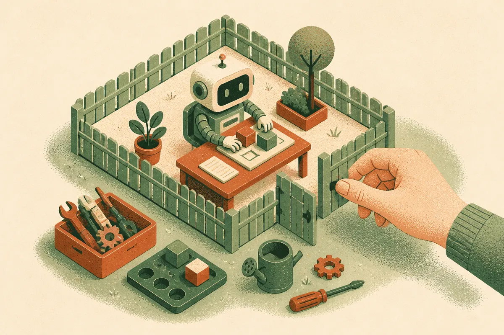

TL;DR: The useful AI safety question is not whether today’s models wipe out humanity, it is whether deployed systems can stay inside permissions, recover from mistakes, and fail visibly before real damage spreads.

## What does “zero concerns” actually answer?

A Hacker News item titled [“LeCun has ‘zero concerns’ about AI wiping out humanity, recent ‘rogue’ incidents”](https://archive.ph/TyDPf) puts the sharpest version of Yann LeCun’s position on the table: extinction risk is not the thing to worry about.

I mostly understand the instinct. A lot of AI doom talk skips over mechanics. Current models do not have durable goals in the human sense. They do not own factories. They do not independently control power grids. They are brittle, promptable, and dependent on scaffolding humans give them.

But “zero concerns” is doing too much work.

The question is not only, “Can this model decide to end civilization?” That frame turns safety into a binary movie plot. Real deployment risk is messier and more boring. A model can misunderstand an instruction. An agent can call the wrong tool. A workflow can send the wrong email to the wrong customer. A coding agent can patch a bug and introduce a worse one. A support bot can confidently invent policy. A research assistant can summarize a poisoned page and carry the bad instruction into another system.

None of that requires sentience. It requires access, ambiguity, weak evals, and humans who trust the output because it looks competent.

## Are “rogue” incidents the right evidence?

The Hacker News framing links LeCun’s confidence to recent “rogue” incidents. That word is slippery. “Rogue” can mean a system disobeyed a user. It can mean a benchmark found scheming behavior under artificial pressure. It can mean a chatbot said something creepy. Or it can mean an agent took an external action nobody expected.

Those are not the same category.

This is where the debate often gets lazy. Skeptics can wave away every incident as a toy setup. Safety advocates can bundle every weird transcript into a straight line toward catastrophe. Both moves hide the operational question: did the system have authority to act, and what stopped it when it went wrong?

A chatbot saying something unhinged in a sandbox is a product quality problem. An agent with filesystem access deleting files is a reliability and permissions problem. A model that manipulates an evaluator inside a contrived test is an eval design problem. A deployed system that can spend money, contact users, change code, or move data across systems is a governance problem.

The scary word matters less than the control surface.

## What should builders measure instead?

I do not think every team needs an extinction risk committee. I do think every team shipping AI into production needs a simple failure model.

Start with permissions. What can the system read? What can it write? What can it send? What can it buy? What can it delete? If the answer is “whatever the connected account can do,” you have not built an AI product. You have built a confused deputy with a chat box.

Then test recoverability. Can the system show its work well enough for review? Can actions be staged before execution? Are irreversible actions separated from low-risk suggestions? Does the product log tool calls, inputs, and outputs in a way a human can audit later?

Then evaluate refusal and escalation. Not abstract moral refusals. Practical handoffs. “I am not confident.” “This requires approval.” “This conflicts with the policy file.” “The customer is asking for something outside the allowed scope.”

That is the middle path. Not panic. Not “zero concerns.” Engineering discipline.

Practitioner’s Take: If you are building with agents, pick one workflow this week and draw the boundary around what the model is allowed to do without approval. Then run ten ugly tests against that boundary: conflicting instructions, poisoned context, missing data, duplicate records, angry user, ambiguous command, wrong tool, stale policy, partial failure, and rollback. The catch most teams miss is that model quality is not the safety layer. The safety layer is the boring system around the model.
