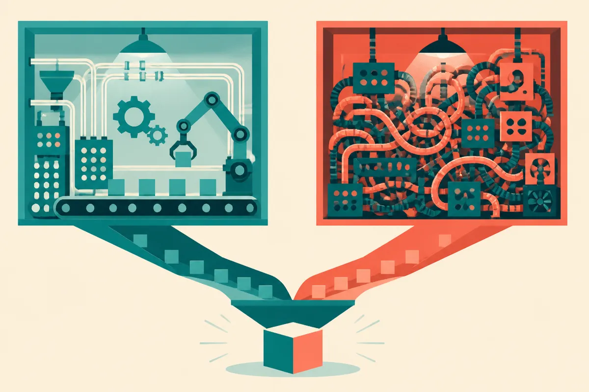

TL;DR: A public claim that OpenAI’s culture is broken should not be treated as proof by itself, but it is a real vendor-risk signal for teams building on frontier models.

## What can we actually learn from the OpenAI resignation claim?

The primary source here is The Guardian’s piece titled “I quit OpenAI because its culture is broken,” which Hacker News pushed into the AI-builder conversation. That title makes one clear claim: someone left OpenAI and is framing the reason as culture, not compensation, role fit, or normal startup churn.

That is not enough to adjudicate the truth of the internal complaint. Hacker News discussion is useful for temperature, not evidence. A first-person resignation story can be sincere and still partial. It can also be accurate about one slice of a company without describing the whole operating system.

But I would not dismiss it as gossip either.

Culture is not a soft variable in frontier AI. It determines what gets shipped, what gets delayed, who can say no, how safety work is weighed against product pressure, and whether bad news travels upward. In a normal SaaS company, broken culture might mean roadmap churn or talent loss. In an AI lab, it can mean rushed model releases, weak incident learning, or teams optimizing for demos over reliability.

That does not mean OpenAI is uniquely broken. It means the operating culture of any frontier lab is part of the product.

## Why does this matter if the models still work?

Because most businesses do not buy “a model.” They buy a dependency.

If a team builds customer support, coding workflows, legal review, research tooling, or agentic automation on top of OpenAI, Anthropic, Google, Mistral, Meta, or another provider, they are also buying that provider’s release discipline. They are buying its security posture. They are buying its tolerance for regressions. They are buying its incentives when revenue, safety, and reputation collide.

Benchmarks will not catch all of that. Neither will a pretty eval dashboard.

The hard part is that frontier model quality and organizational trust can move in different directions. A lab can ship excellent models while its internal trust decays. A lab can have a healthy governance story and still ship a model that fails your use case. Operators need both views at once.

This is where the public conversation often gets lazy. One camp treats every ex-employee warning as proof that the company is reckless. Another treats every warning as sour grapes. Neither posture helps builders.

The practical reading is simpler: this is one more reason to avoid single-provider dependence when the workflow is critical.

## How should builders respond without overreacting?

Treat culture claims like you treat model evals: one signal, not the whole decision.

If you are using OpenAI in production, do not rip it out because of one resignation story. Do run the boring checks. Can you swap models for key tasks? Do you have regression tests on prompts and agent behavior? Are logs structured enough to spot drift? Do you know which workflows fail closed versus fail open? Have you tested the same workload against at least one other model family?

Also separate product convenience from strategic lock-in. OpenAI may still be the best choice for a given workload. The point is not to punish a vendor for a headline. The point is to notice when your architecture assumes that one lab’s internal judgment will always match your risk tolerance.

The catch most readers miss: vendor risk in AI is not only outages, pricing, or API changes. It is also the decision culture behind model releases. A builder can act on that without drama: keep evals portable, preserve fallback paths, document model-specific behavior, and avoid letting any single provider become invisible infrastructure.
