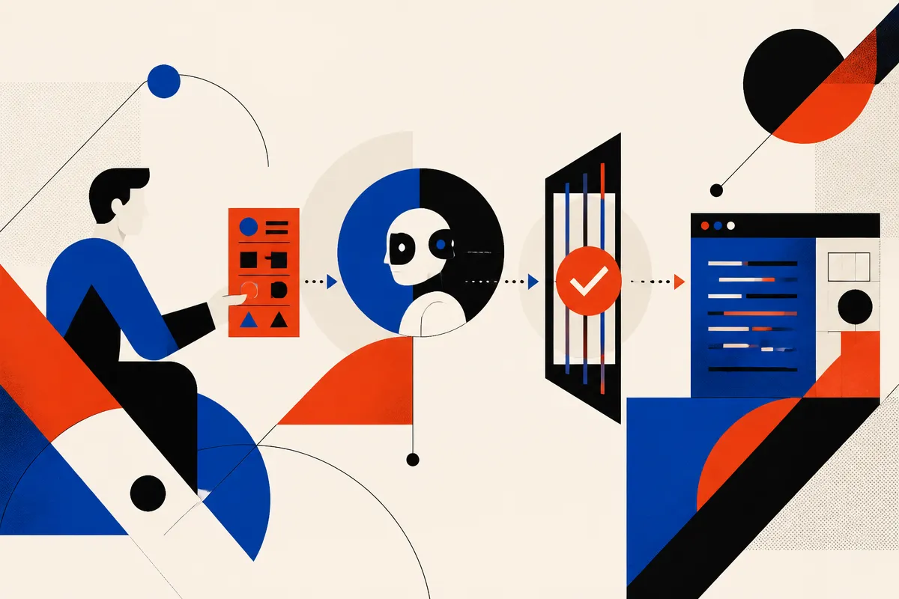

TL;DR: Treat “getting the most out” of a frontier model as a workflow problem, not a prompt trick problem.

## What can we actually say from the source?

The primary source named here is the Hacker News item titled “Getting the most out of Opus 5.5 in Claude and Claude Code.” That is thin sourcing. It tells us the discussion is about Claude, Claude Code, and Anthropic’s Opus line, but it does not give pricing, availability, model-card claims, benchmark numbers, context limits, or release mechanics.

So I am not going to pretend we have those details.

What we do have is the shape of the story: another high-end model, another “how to get the most out of it” moment, and another chance for teams to confuse model capability with operating discipline.

That distinction matters. Claude Code and similar coding agents do not fail only because the model is weak. They fail because the task is underspecified, the repo is messy, the tests are missing, the user asks for five changes at once, or nobody checks the diff before it lands. Better models reduce friction. They do not erase the need for a work system.

The practical question is not “what magic prompt works for Opus 5.5?” It is “what shape of work gives a strong model enough context, constraints, and feedback to do useful work safely?”

## What changes when the model gets stronger?

Stronger models tend to expand the size of tasks people hand them. That is both the gain and the trap.

A small model gets asked to rename a function. A stronger model gets asked to refactor the auth layer, write tests, update docs, and explain tradeoffs. Sometimes that works. Sometimes it creates a beautiful-looking diff that quietly breaks an edge case three directories away.

For coding agents, I still like a boring rhythm:

Give the agent a narrow goal. Ask it to inspect before editing. Make it propose a plan. Keep the first patch small. Run tests. Ask it to explain what changed and what it did not touch. Then continue.

That sounds slow until you compare it with debugging a giant agent-generated patch at 11 p.m.

Claude Code-style tools are most valuable when they sit inside an existing engineering loop. Issue, branch, inspect, patch, test, review. The agent can speed up each stage, but it should not dissolve the stages into one giant “do the thing” request.

This also applies outside coding. For research, support ops, content systems, and internal automation, the pattern is the same: context first, bounded task second, verification third.

## Is model-specific advice still useful?

Yes, but only after you separate durable practice from model folklore.

Model-specific advice can matter. Some models follow long instructions better. Some are better at tool use. Some are more willing to ask clarifying questions. Some produce cleaner code but over-explain. Some need more explicit constraints around files, style, or tests. If Anthropic publishes guidance for Opus 5.5 in Claude and Claude Code, builders should read it.

But the durable layer is not going away.

A useful agent workflow usually includes a few stable pieces: a clear task brief, relevant files or docs, success criteria, permission boundaries, test commands, and a review step. If the model improves, that workflow gets more powerful. If the model disappoints, that workflow limits the blast radius.

The hype version says each new model changes everything. The operator version says each new model changes the default batch size. You can hand it slightly harder work, with fewer reminders, and expect better first drafts. You still need judgment.

My test would be simple: take three real tasks from the last week, run them through Opus 5.5 in Claude or Claude Code using the same structured workflow, and compare time saved, number of corrections, and review confidence. Not vibes. Receipts.

A builder should use this as a prompt to tighten the system around the model. Write a reusable task template for Claude Code. Add the test command. Add “inspect before editing.” Add “show risky assumptions.” Try it on small production-adjacent work before giving it a sprawling refactor. The catch most readers miss: the model upgrade is less important than whether your team can repeatedly hand off work in a form an agent can execute and a human can verify.
