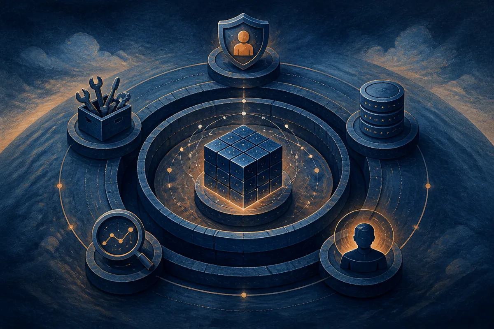

TL;DR: The durable SaaS product is less likely to be “an AI wrapper” and more likely to be the control system that makes a model safe, useful, auditable, and tied to real work.

## What does “a harness around a model” actually mean?

The primary source here is the Hacker News item titled “Every SaaS business will become a harness around a model.” It is a clean line because it compresses a real shift. It is also easy to overread.

A harness is not just a chat box sitting on top of GPT, Claude, Gemini, or an open model. A real harness constrains the model. It gives the model tools, context, permissions, memory, user intent, workflow state, retries, escalation paths, and a way to measure whether the output was good enough.

That is very different from the old “thin wrapper” insult. A thin wrapper sends a prompt to a model and displays the answer. A harness turns a probabilistic model into something an organization can actually put inside a business process.

Think about the boring parts: who can see customer data, which system is allowed to update a record, when a human has to approve an action, what gets logged, what happens when the model refuses, hallucinates, times out, or confidently does the wrong thing. That is not glamorous. It is the product.

## Does this make SaaS less defensible?

Some SaaS does get less defensible when the core feature was just generating text, classifying a ticket, summarizing a meeting, or drafting an email. Those jobs are becoming model-native. If the product has no private workflow context, no distribution, no switching cost, and no trusted place in the operating rhythm, it is exposed.

But the opposite is also true. A good SaaS product already owns a narrow workflow. It knows the objects, the permissions, the handoffs, the exception cases, and the user’s actual goal. Models make that product more capable, not automatically obsolete.

The defensibility moves. It shifts from “we built the best form and dashboard” to “we are the safest place to let an AI act on this workflow.” That means the moat is not the model alone. Most companies will not train frontier models. They will choose, route, test, and govern models. They will build product judgment around where automation helps and where it should stop.

The cheap take is that every SaaS company becomes a wrapper. The better take is that every serious SaaS company becomes a policy engine, integration layer, eval loop, and user experience around one or more models.

## What changes for builders?

The product spec changes first.

Instead of asking, “Where do we add AI?”, ask, “What decision or action in this workflow is expensive because it requires reading, writing, checking, or coordinating?” Then ask whether a model can reduce that cost without creating a worse failure mode.

That second part matters. Many AI features look impressive in a demo because the demo has no consequences. Enterprise software lives in edge cases. A sales note goes to the wrong account. A support bot promises something the company cannot honor. A finance workflow updates the wrong field. A healthcare or legal workflow cites a fact that is not there.

So the harness needs evals. Not vibes. Small, repeated tests based on real tasks. It needs observability, so teams can see failure patterns. It needs permission boundaries, so a model cannot do everything just because it can read everything. It needs a clean handoff to humans, because partial automation is still valuable when designed honestly.

I also think the interface will change. Less “AI assistant bolted to the side.” More model behavior embedded directly inside the workflow. The best version may not look like a chatbot at all. It may look like fewer fields, better defaults, smarter routing, prefilled work, and well-timed questions.

Practitioner’s take: pick one workflow your product already owns and map the model harness around it: context in, tools available, actions allowed, checks required, logs kept, and human approvals needed. Then build the smallest version that saves time without pretending to be fully autonomous. The catch most teams miss is that the harness is not a feature layer. It becomes the product architecture.
