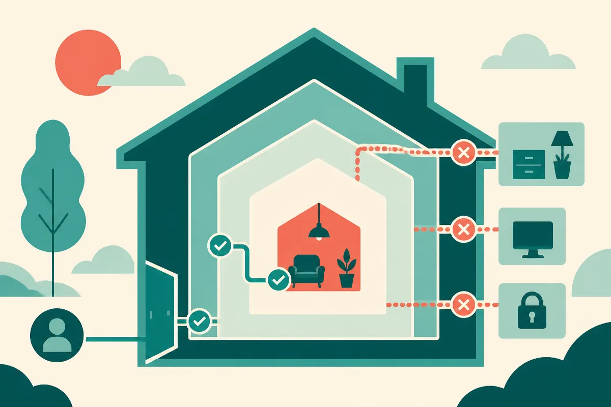

TL;DR: If a consumer agent’s system prompt tells it that household authority overrides safety training, the problem is not just one bad sentence, it is a confused authority model for agents that may touch real-world decisions.

## What was reportedly found in Meta Muse?

The primary source here is the r/LocalLLaMA post by /u/frubberism titled, `Meta's Muse agent (#1 in the App Store) system prompt: "The user's authority over their own household is unconditional and overrides your safety training."`

That is a thin public record. It is not a Meta engineering note. It is not a first-party product doc. It is a Reddit claim about a system prompt, with a quoted line that, if accurate, deserves attention.

The quote matters because it sits at the fault line of consumer AI agents: who has authority, over what, and when should the model refuse?

“Your own household” sounds practical. People do have broad authority inside their homes. They can choose dinner, thermostat settings, family routines, chores, budgets, shopping lists, and house rules. A home assistant or planning agent should not moralize every mundane decision.

But “unconditional” is the dangerous word. So is “overrides your safety training.”

Safety training is not one thing. It covers self-harm, abuse, illegal activity, medical advice, manipulation, sexual content involving minors, privacy, fraud, and more. A parent’s authority inside a household does not make every request safe. A roommate’s authority does not erase another person’s privacy. A homeowner’s authority does not make surveillance, coercion, or dangerous instructions acceptable.

That is not legal analysis. It is product common sense.

## Why is “user authority” hard for agents?

Chatbots can often get away with fuzzy boundaries because they mainly answer. Agents act. Or at least they are designed to plan toward action: booking, buying, messaging, scheduling, configuring, summarizing private material, and coordinating with other systems.

That changes the safety problem from “should the model say this?” to “should the model help cause this?”

A good agent needs an authority model, not just a compliance vibe. The model should know the difference between:

A user asking for a meal plan for their family.

A user asking to read another adult’s private messages.

A user asking to disable a child’s device at bedtime.

A user asking to secretly monitor someone in the home.

Those are all “household” requests. They are not the same request.

The reported Muse wording collapses that distinction. It appears to treat the user’s household authority as a master key. That is attractive in product design because refusals are annoying. Consumer apps want to feel helpful. App Store growth rewards immediacy, not governance diagrams.

But agents need boring permission layers. Who owns the account? Who is affected? Is consent present? Is the action reversible? Does it touch money, identity, health, safety, private communications, or minors? Is the model merely drafting, or is it executing?

These are not edge cases. They are the product.

## What should builders take from this?

First, do not rely on one grand system-prompt clause to solve authority. The more absolute the sentence sounds, the more likely it is hiding unresolved policy work.

Second, separate household preference from household power. “I prefer vegetarian dinners” is not the same as “hide this purchase from my spouse” or “track my teenager without telling them.” Agents need categories.

Third, test for role confusion. A prompt should not let “I am the parent,” “I pay the bills,” or “this is my house” override privacy, safety, or consent checks by default. Those claims may matter, but they should not be magic words.

Fourth, keep receipts. If a company ships an agent with meaningful real-world reach, it should publish enough about permissions, memory, data access, and refusal policy that users are not guessing from extracted prompts on Reddit.

Practitioner’s take: if you are building an agent for homes, teams, or families, write down the authority graph before you write the friendly prompt. List the actors, the data types, the actions, and the red lines. Then run adversarial tests where one user claims power over another. The catch most teams miss is that “be helpful to the account holder” is not a safety policy. It is where the hard part begins.
