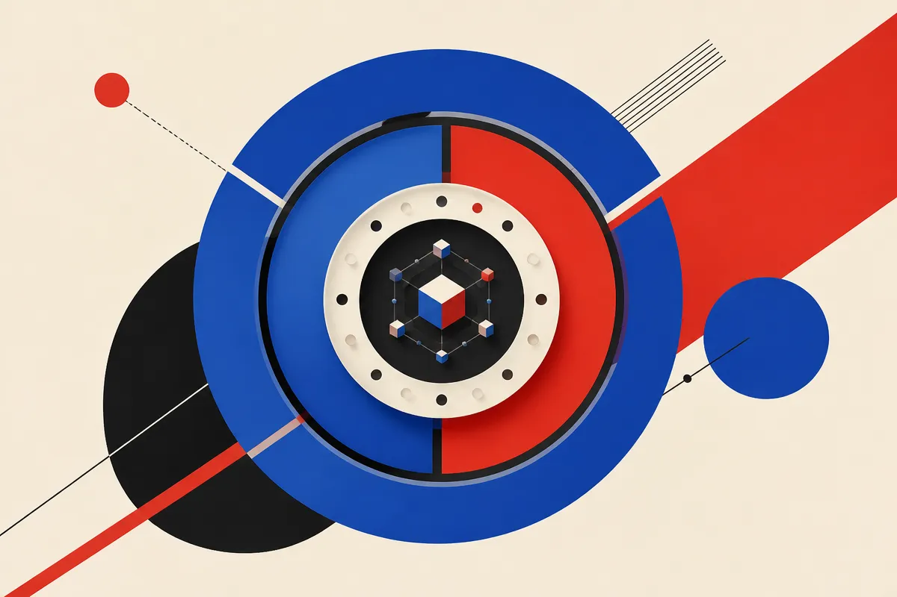

TL;DR: A high-profile safety departure is a signal worth watching, but it is not a product spec, and the only responsible move for a builder is to assume you own the safety layer regardless of what any lab says about its own culture.

The story in front of me is thin. Hacker News surfaced a headline, "OpenAI safety leader quits, warning AI company's culture is 'broken'," and that is the extent of the primary material I have in hand. No resignation letter quoted in full. No name I can verify from the source given. No OpenAI statement attached. So I am going to do the honest thing and treat this as what it is: a reported departure, not a confirmed indictment, and then talk about how to actually reason about these moments when they land.

Because they land often. And the pattern around them is more useful than any single exit.

## What do we actually know here, and what is just the headline?

What I can say: the headline claims a safety leader at OpenAI resigned and characterized the company's culture as "broken." That is a reported claim via Hacker News aggregation. I do not have the original letter, the person's name confirmed, or OpenAI's response in the material provided. Everything past the headline is inference, and I will flag it as such.

That matters because "culture is broken" is doing a lot of work in that sentence. It could mean safety review got deprioritized under shipping pressure. It could mean one person disagreed with a roadmap call. It could mean a genuine governance breakdown. The headline collapses all three into the same four words, and the internet will happily pick whichever reading confirms what it already believed.

I have watched enough of these to know the shape. A senior person leaves. The framing is dramatic. The specifics, when they eventually arrive, are usually narrower and messier than the headline. Sometimes the departure is a real alarm. Sometimes it is a disagreement dressed up by coverage that needs a villain. Without the primary document, I cannot tell you which this is, and neither can anyone else quoting the same headline.

## Why do safety departures keep happening at the frontier labs?

Step back from this specific exit and the pattern is clear enough to reason about. Frontier labs run two clocks at once. One clock is competitive: ship capability before the other lab does, because being second costs money and mindshare. The other clock is caution: test, red-team, slow down when the evidence says slow down. Those clocks disagree constantly, and the people hired to watch the caution clock are structurally the ones most likely to quit loudly when they feel the competitive clock winning.

This is not unique to OpenAI. The same tension produced the high-profile safety and governance departures across the frontier labs over the past two years. The job description for a safety leader is, in part, to be the person who says no, and an organization optimized to ship fast will generate friction with that role by design. A departure, on its own, is evidence that the tension exists. It is not proof of which clock is right in any given case.

So when I see one of these, I do not ask "is the lab evil now." I ask: is there a specific capability or deployment decision named, is there corroboration from more than one person, and is there anything concrete I can verify. On this story, with only the headline in hand, the answer to all three is no yet. That is not me defending OpenAI. It is me refusing to build my worldview on a word like "broken" with nothing underneath it.

## How should a builder respond to this kind of news?

Here is the part that actually changes what you do on Monday: almost nothing, if you were building correctly already.

If your product's safety depends on OpenAI's internal culture being healthy, you have a design problem that predates any resignation. The lab's model is a component. You do not control its training, its guardrail tuning, its deprecation schedule, or its internal politics. You control the layer you wrap around it. That is where your real safety budget should sit.

Concretely, that means input and output filtering you own and can test. It means logging and eval suites that catch regressions when the underlying model changes under you, which it will, with or without a safety team in place. It means a fallback plan for when a model version you depend on gets pulled or changed. The builders who got burned by past model deprecations were not the ones who distrusted the lab. They were the ones who assumed the lab's stability was their stability.

A dramatic headline is a good prompt to run that audit. Not because the sky is falling, but because the exercise is useful whether or not this particular departure means anything.

## Does any of this change whether you should trust OpenAI's models?

Trust is the wrong frame. You do not trust a dependency; you verify it and you contain the blast radius when it fails.

The useful question is not "does OpenAI have good vibes internally." It is "does this model, at this version, pass my evals for my use case, and do I have monitoring to know when that stops being true." That question has an answer you can measure. "Is the culture broken" does not, at least not from where I sit with this material.

I will update hard if the primary document shows up and names a specific unsafe deployment decision with corroboration. That would be a real story about model reliability, and I would cover it as one. Until then, I am logging this as a signal in a known pattern, not a verdict.

The practitioner's take: treat every frontier lab, including OpenAI, as a vendor whose internal state you cannot see and should not assume. Build the safety and reliability layer you actually control: your own eval suite that runs on every model version bump, output filtering you can inspect, logging that tells you when behavior drifts, and a documented fallback if a model you depend on changes or disappears. Do that and a headline like this becomes what it should be, a reminder to run your audit, not a reason to panic or to shrug. The catch most readers miss is that the people quoting "broken culture" loudest and the people defending the lab loudest are making the same mistake: both are treating a four-word headline as enough information to act on. It is not. Verify the primary source before you form the verdict, and build as if no verdict will save you.
