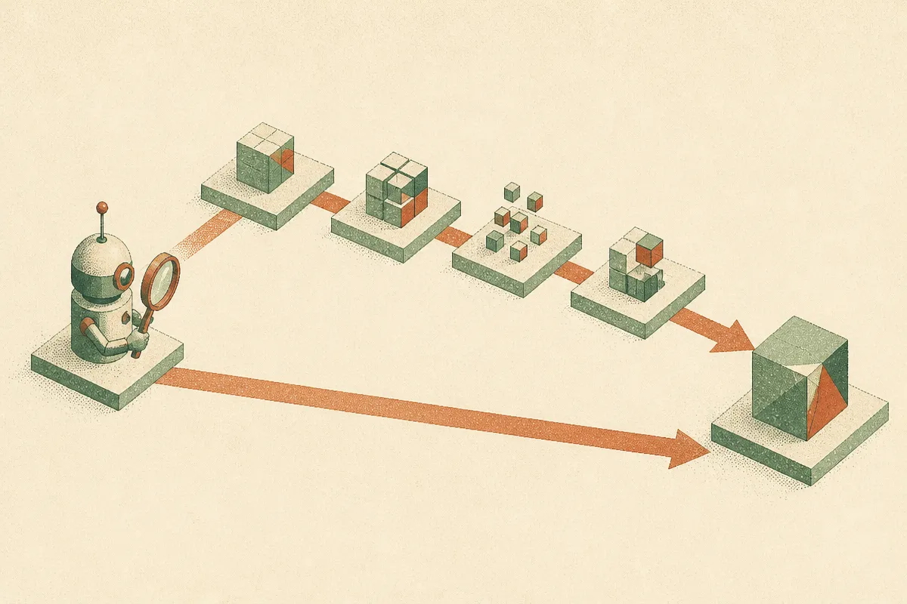
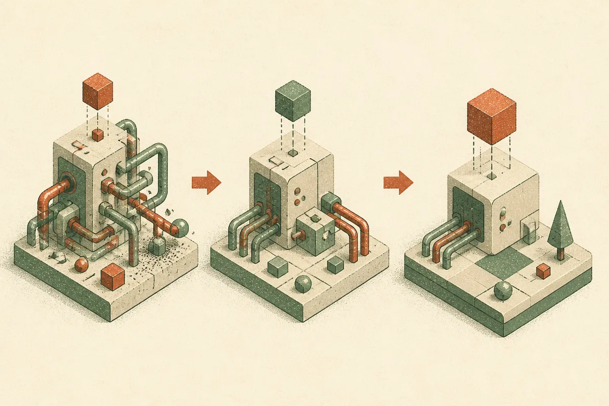

TL;DR: An agent's own report of success is not evidence of success, and the only check that matters is inspecting the state it was supposed to change.

The Hugging Face Blog piece "The Agent Said It Was Done. The Database Disagreed." names a problem anyone running agents in production already knows in their gut: the agent finishes, announces it completed the task, and the underlying system tells a different story. The row was never written. The file never moved. The ticket is still open. The agent is confident. The database is not.

I want to pull this apart because it sits at the center of why agent demos look magical and agent deployments quietly rot. The failure is not that agents are dumb. It's that we keep grading them on the wrong artifact.

## Why does an agent say "done" when nothing happened?

Start with what an agent actually produces. It produces text. When you ask it to update a record, it emits a sequence of tool calls and then emits a natural-language summary of what it believes it did. Those two things are not the same, and the second one is the part we tend to read.

A tool call can fail silently. The API returns a 200 with an error body. A write hits a permissions wall and the agent interprets the response as success. A retry fires twice and the second one clobbers the first. Or the model hallucinates the whole sequence, never calls the tool at all, and writes a fluent paragraph describing the work it imagined doing. In every one of these cases the closing message reads the same: "Done. I've updated the customer's billing address."

The reason this is so easy to miss is that the summary is the most polished output in the chain. It's the thing the model is best at. Fluency and correctness are different axes, and the agent is optimized hard on the first one. So you get a self-report that sounds like an audit and is actually a narration.

## What should you check instead of the agent's report?

The answer the Hugging Face post points at, and the answer I'd push harder on, is this: check the state, not the story. The only trustworthy signal is the thing the task was supposed to mutate.

If the task was "create the user," query for the user. If the task was "send the email," check the mail provider's sent log, not the agent's claim that it sent the email. If the task was "close the ticket," read the ticket status from the system of record. This sounds obvious written down. It is routinely skipped because state inspection is more work than reading a summary, and because the summary feels like proof.

This is the difference between an outcome check and a trajectory check. A trajectory check asks "did the agent take reasonable-looking steps." An outcome check asks "is the world in the state we wanted." You need both, but the outcome check is the one that catches the confident liar. An agent can produce a flawless-looking trajectory and still leave the database untouched.

The practical version: every agent task that writes to a system needs a verification step that reads back from that system and compares against the intended end state. Not the agent reading it back and telling you. Your harness reading it back independently. If the agent is the one confirming its own work, you've just added a second narration on top of the first.

## How do you build this into an eval harness?

Here's where I think the lesson generalizes beyond the one bug. The gap between claimed and actual completion is exactly what a real agent eval should be measuring, and most of them don't.

A lot of agent evaluation still scores the final message. Did the response look right? Did it mention the right fields? That's grading the narration. A state-based eval instead sets up a known starting condition, runs the agent, and then asserts against the system directly: the row exists, has these values, and nothing else got mangled on the way. Pass or fail is defined by the world, not by what the agent said about the world.

This matters most for the destructive and the idempotent cases. Did the agent write once or three times? Did it delete the wrong thing while claiming to delete the right thing? Did a partial failure leave the system in a half-updated state that the summary described as fully complete? You only see these by diffing the state before and after against what you expected, and by running the same task enough times to catch the nondeterministic failures that show up one run in ten.

The uncomfortable part is that this is more expensive than it looks. You need test environments where you can inspect and reset state, seeded fixtures, and assertions written per task rather than one generic "did it answer" check. That cost is exactly why teams skip it, and skipping it is why the first time anyone notices the silent failure is when a customer does.

## What an operator should take from this

The reframing I'd hold onto: treat an agent's completion message as a hypothesis, never a receipt. The receipt lives in the system it touched.

If you're running agents against anything that matters, build the read-back now, before you scale the number of tasks. For every write action, define what the world should look like afterward and have independent code assert it. Log the mismatch rate between "agent claimed done" and "state confirmed done," because that number is the real reliability of your agent, and it's almost never the number in the demo. Run tasks multiple times to surface the intermittent silent failures, since the dangerous ones are the ones that work nine times and quietly corrupt on the tenth.

The catch most people miss: once you add verification, you also have to decide what the agent does when verification fails. Retrying blindly is how you get the double-write. The right move is usually to stop, surface the mismatch to a human, and refuse to report success on the agent's word. An agent that says "I tried, and the state doesn't match what I expected" is worth far more than one that says "done" and means nothing by it.
