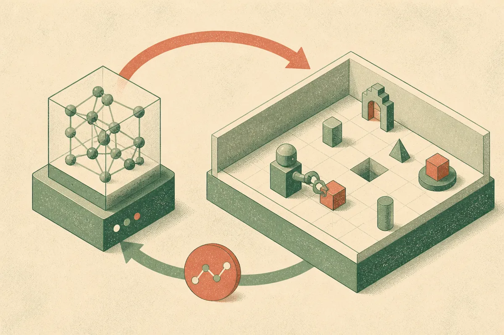

TL;DR: Hugging Face putting RL environments on the Hub matters because agents need repeatable worlds to train and test in, not just better prompts and nicer demos.

## What changes when RL environments become Hub artifacts?

Hugging Face announced **“Welcome RL Environments to the hub”** on the Hugging Face Blog. The important part is not that reinforcement learning is suddenly new again. It is that environments are being treated as shareable AI infrastructure.

That is a real shift.

For language models, the Hub already made models, datasets, demos, and adapters easier to find and reuse. Agent work has a different missing piece: the world the agent acts inside. A model can answer a prompt in isolation. An agent needs state, tools, rules, resets, failures, and feedback. Without those, “it worked in my demo” is doing too much work.

An RL environment gives the agent a place to act. It can try something, observe the result, get a reward or penalty, and try again. That loop is the whole point. A browser task, a coding task, a database repair task, a game, a simulated robot, a customer support workflow, all can be environments if they define actions, observations, and success clearly enough.

This also makes the Hub more interesting as a marketplace of repeatable tasks. Not financial marketplace. Practical marketplace. If environments are easy to share, fork, inspect, and run, builders can stop reinventing tiny sandboxes for every agent experiment.

## Is this more about training or evaluation?

Both, and that is why it matters.

Training needs feedback. Evaluation needs repeatability. RL environments sit at the intersection.

For training, the environment can provide the signal that a model needs to improve through trial and error. That does not mean every agent should be trained with RL. Many useful systems are still plain tool-calling workflows with good prompts, routing, retrieval, and guardrails. But when the task has a real outcome, such as “fixed the bug,” “completed the form,” or “recovered from a bad tool call,” an environment can capture more than a static benchmark question.

For evaluation, shared environments are even more immediately useful. A builder can run different agents against the same task setup and compare behavior. Not just final score, but path taken, tool calls made, retries, failures, and recovery. That is closer to how agent systems break in production.

The catch is that environments can lie too. A reward can be too narrow. A task can be too clean. A reset can hide state that real systems would keep. An agent can learn to game the scoring rule instead of solving the actual job. If the environment rewards “submitted something” instead of “submitted the right thing safely,” you get a confident mess with a score attached.

That is the boring work. Also the valuable work.

## What should builders watch for?

I would look at three things before trusting any shared RL environment.

First, inspectability. Can you see the task definition, reward logic, allowed actions, hidden state, and failure conditions? If not, it is hard to know what the agent is actually learning.

Second, versioning. An environment changing under a benchmark can make results meaningless. Models get pinned. Datasets get pinned. Environments need the same discipline.

Third, transfer. A good environment should teach or test behavior that survives outside the sandbox. Tool use. Planning. Error recovery. Constraint following. Long-horizon persistence. If an agent only performs inside one narrow setup, useful, but limited.

Hugging Face’s announcement is a good sign because it moves attention from model screenshots to the surrounding system. Agents are not just models. They are models plus tools plus memory plus policies plus execution context. Environments make that context explicit.

Practitioner’s take: pick one workflow you already care about, then turn it into a small environment before chasing a general agent. Define the start state, allowed actions, success condition, and failure cases. Run two or three model-agent setups against it. The catch most readers miss: the environment design will teach you more than the leaderboard score. It forces you to say what “done” actually means.
