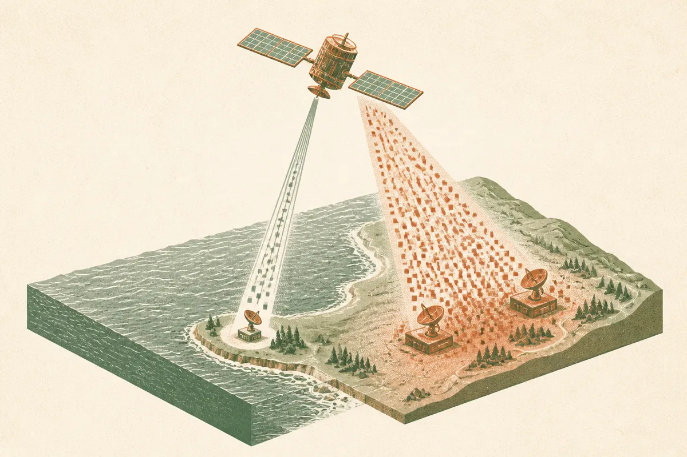
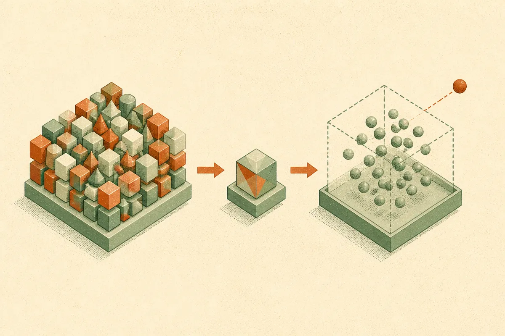

TL;DR: Moving anomaly detection onto the satellite, rather than streaming every image to the ground, turns a bandwidth problem into a compute problem you can actually afford, and that trade matters for any edge AI system where moving the data costs more than running the model.

The paper is "On-Board Anomaly Detection for Efficient Marine Environmental Monitoring," posted to arXiv under both cs.AI and cs.LG. It describes a detection pipeline that runs on Earth observation satellites carrying multi- or hyperspectral sensors, built to catch oil spills, algal blooms, and sediment floods. What makes it worth reading is not the marine science. It is the architecture decision underneath it, which generalizes to a lot of problems that have nothing to do with the ocean.

## Why run the model on the satellite at all?

The obvious design is to let the satellite be a camera. Capture images, beam them down, process everything on a ground station with real hardware. That works until you count the bits. Hyperspectral sensors produce enormous files, satellite downlink windows are short, and bandwidth is the scarce resource, not storage or even raw compute.

So the authors flip it. Instead of transmitting everything and deciding what mattered later, the satellite decides first and transmits selectively. The paper frames this as prioritizing "the transmission of critical information" and treating detection as a data reduction step. That is the whole move. You are not trying to make the model smarter than a ground-based system. You are trying to avoid sending gigabytes of empty ocean.

This reframing is the part worth stealing. Plenty of pipelines I see default to "collect raw, process centrally" because that is how the cloud era taught us to build. When the link between collection and processing is cheap, that is correct. When the link is the bottleneck, as it is on a satellite or a remote sensor or a phone on a bad connection, the economics invert. You want the filtering to happen where the data is born.

## How does the pipeline actually work?

Two stages. First, a self-supervised neural network encoder compresses each satellite image into a reduced latent space. Self-supervised matters here because you do not have a clean labeled dataset of every anomaly type floating in every sea condition. The encoder learns what normal looks like from the data itself, no human labels required for the representation step.

Second, a machine learning anomaly detection model looks at that compressed representation and flags deviations from normal sea patterns. Anomaly detection rather than classification is a deliberate choice. You are not asking "is this an oil spill versus an algal bloom." You are asking "is this unusual enough to be worth a human looking at it." That is a lower bar to clear and a more honest one, because the space of weird things the ocean can do is larger than any label set you could pre-define.

The authors compare their learned approach against three traditional outlier methods: Isolation Forest, One-Class Support Vector Machine, and Local Outlier Factor. Those are the sensible baselines for anomaly detection, and I am glad they ran them. The paper claims its pipeline performs better, though the abstract given here does not break out the numbers, so treat the margin as reported rather than something I can verify from what is in front of me.

## What does "runs on limited hardware" really require?

The pipeline is described as lightweight and resource-efficient, targeted at everything from embedded CPUs to AI hardware accelerators on the satellite. This is the unglamorous engineering that makes the whole thing real. A model that needs a datacenter GPU is useless in orbit. The encoder-plus-detector split helps here too: the heavy representation learning can be front-loaded, and the detection step operating on a small latent vector is cheap to run.

The credibility signal is deployment, not benchmarks. The authors report integration across real missions: the European Space Agency's Phisat-2, and the Microsoft and Thales Alenia Space IMAGIN-e mission. I take that as the strongest claim in the paper. Plenty of edge AI work stops at "we simulated it on a laptop." Getting a model qualified to run on actual flight hardware is a different discipline, with power budgets, radiation tolerance, and no option to SSH in and restart the process when it hangs.

That constraint is exactly why the lesson transfers. When you cannot easily update or babysit a deployed model, you design for robustness and simplicity on purpose. Anomaly detection that errs toward flagging and lets a human adjudicate on the ground is a reasonable failure mode. A brittle classifier that silently mislabels is not.

## Where else does this pattern apply?

Swap "satellite" for any setting where moving data costs more than running inference. Industrial sensors on a factory floor with intermittent connectivity. Wildlife cameras in the field running on solar. Medical devices that cannot stream patient data to the cloud for privacy reasons. In every case the same question applies: is the link between where data is captured and where it is processed cheap or expensive? If expensive, push a filter to the edge and only send what clears the bar.

The catch most people miss is that edge filtering changes what you can learn later. When the ground station only ever sees the flagged events, your training data for the next model version is biased toward what the current model already thought was interesting. You lose the baseline of normal unless you deliberately sample some of it too. A satellite that only ever sends anomalies will slowly forget what ordinary ocean looks like, and so will the team maintaining it.

Practitioner's take: if you are building anything that collects data far from where it gets processed, do the arithmetic before you pick an architecture. Cost per gigabyte transmitted times volume, against cost of running a small model at the source. When transmission wins, the move in this paper is your template: a self-supervised encoder to compress to a latent space, a cheap anomaly detector on top, and a bias toward flagging for human review rather than autonomous classification. Validate against boring baselines like Isolation Forest so you know the learned model is actually earning its complexity. And budget, from day one, for periodically shipping a sample of the normal data down too, or your next model will be trained on a distorted picture of the world. The satellite constraint is extreme, but the trade it forces is one most edge systems should be making and quietly are not.
