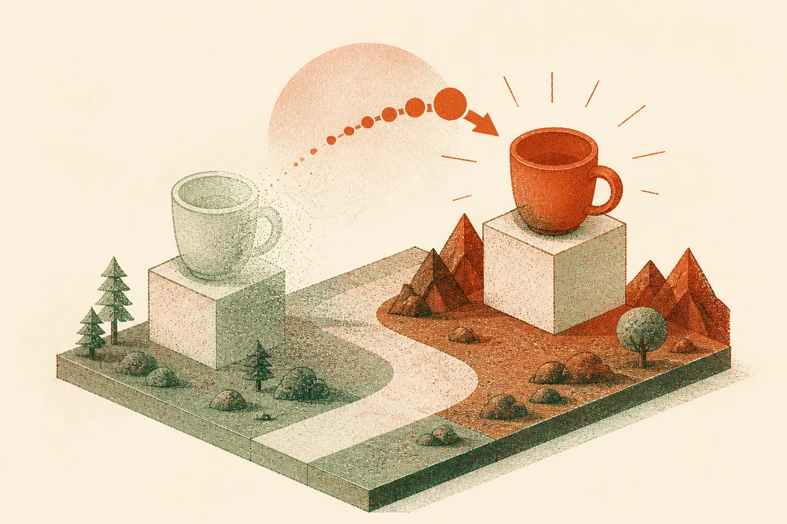
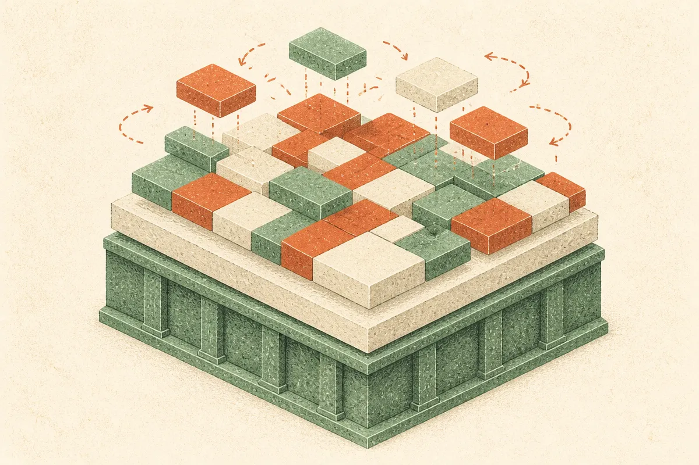
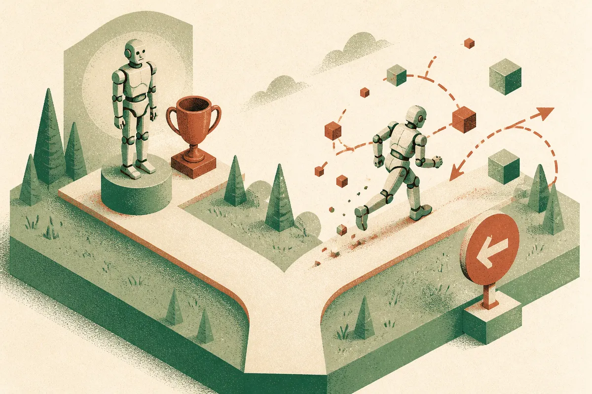

TL;DR: A world model that still "remembers" where your coffee cup was yesterday is broken, not faithful, and the paper "What Should World Models Forget? Stratified Retention for Continual Adaptation" argues our metrics have the sign flipped: they reward models that refuse to update over ones that correctly revise.

Most of the continual learning field inherited one quiet assumption: a correct label stays correct. Train a classifier to recognize a cat, and that cat is still a cat next week. Under that assumption, any drop in accuracy on old data looks like damage. We even gave it a scary name, catastrophic forgetting, and built a decade of methods to prevent it.

The arXiv paper "What Should World Models Forget? Stratified Retention for Continual Adaptation," posted to both cs.AI and cs.LG, makes a simple point that lands hard once you sit with it. World models don't predict a fixed label. They predict an environment. And environments move.

## Why does "forgetting" mean something different for a world model?

A world model's job is to represent how the world is, so it can predict what happens next. The paper's framing is that the prediction target is the environment itself, not a frozen annotation. So knowledge that was accurate when the model learned it can simply become false later. The cup moved. The door is now locked. The road got a new detour.

When that happens, discarding the old belief isn't a defect. It's the required behavior.

That inverts the usual story. In classification, forgetting old data is failure. In a world model, failing to forget a stale fact is the failure. The model that stubbornly insists the cup is where it was an hour ago hasn't preserved knowledge. It's hallucinating the past into the present.

The authors tie this to two existing bodies of work. Concept drift, from the streaming and online learning literature, already studies non-stationary ground truth. And the temporal factuality problem in language models, where a model trained in one year confidently reports an outdated head of state or a since-corrected fact, is the same disease in a different organ. What the paper claims hasn't been done is formulating this specifically for world models, which have a feature those other settings mostly lack.

## What makes world models different from language models here?

This is the part worth slowing down on. Language models mostly carry facts, and facts have expiry dates. World models carry two very different kinds of knowledge at once, and the paper's whole argument hinges on keeping them separate.

There's knowledge that must never be revised. Objects don't wink out of existence when occluded. Gravity points down. Push a glass off a table and it falls. Object permanence. Basic physics. These are invariants, and a model that "learns" to abandon them hasn't adapted, it's broken.

Then there's instance-level knowledge, the stuff tied to a specific moment. Where that specific cup is. Which door is open. What the current weather is. This should be revised the instant the environment changes, and holding onto it is a bug.

So the retention problem isn't one dial. The paper argues for retention stratified by invariance timescale: some knowledge has an effectively infinite shelf life and some has a shelf life of seconds, and treating both with one forgetting metric guarantees you get at least one of them wrong.

I find this framing genuinely clarifying because it names a thing a lot of us have felt without articulating. When people complain that video and world models produce physically impossible scenes, that's an invariant violation. When they complain a model's internal state is stale, that's a revision-latency problem. Those are opposite failure modes, and a single "forgetting" number smears them together.

## Why do current forgetting metrics reward the wrong model?

Here's the sharp edge of the paper. Standard forgetting metrics, the authors argue, cannot tell the difference between a world model that correctly revised an outdated belief and one that suffered catastrophic forgetting. Both show up as "accuracy on old data went down." The metric sees a number drop and calls it damage in both cases.

The consequence is damning: those metrics rank a frozen model highest. A model that never updates never "forgets" anything by the old definition, so it wins the benchmark while being useless for anything dynamic. And the authors note that existing physical-reasoning benchmarks evaluate only frozen checkpoints, which means they never test the thing that actually matters for a continual world model, whether it can revise instance facts without corrupting its invariants.

Their proposal is called differential retention. Instead of collapsing everything into one aggregate score, it reports two things side by side. First, invariant regression testing across the adaptation stream: does the model still respect physics and object permanence after it's been learning on new data? Second, revision latency: how fast does it update instance-level facts once the environment actually changes? Critically, the paper says to report these without aggregation. The moment you average them into one number, you're back to the broken metric that can't distinguish revision from decay.

That "no aggregation" insistence is the move I'd underline. We love a single leaderboard number. But a single number is exactly what hides the tradeoff you most need to see.

## Where this bites for people building with world models

This is a position paper with a measurement proposal, not a new model or a benchmark you can download today. The sources here describe the argument and the metric design, not experimental results or a released suite, and I'd treat it that way. Its value is in reframing what you measure, not handing you a tool.

But the reframing is useful well beyond academic world models. Any system that maintains state over time has this exact split. An agent with memory carries durable facts (your preferences, your name, how your codebase is structured) alongside volatile ones (what file you're editing right now, which ticket is open). RAG systems carry documents that are evergreen next to documents that got superseded last week. The failure mode is identical: either the system clings to stale state, or it's so eager to forget that it drops the things that should be permanent.

Practitioner's take: steal the two-axis idea even if you never touch a world model. When you evaluate any stateful AI system, agent memory, a RAG index, a long-running assistant, stop scoring it with one retention number and build two tests instead. One is a regression suite of invariants that should never change, the facts and constraints that, if the system ever revises them, something has gone badly wrong. The other measures revision latency: inject a change into the environment and count how long the system keeps acting on the old reality. Most teams only have the first test, which is why their agents feel "sticky" and keep citing yesterday's state. Some teams, chasing freshness, only have the second, and their agents forget the user's name to chase the latest message. The catch most readers will miss is that these two numbers pull against each other, and the paper's real contribution is refusing to let you hide that tension behind an average. Keep them separate. The gap between them is the information.
