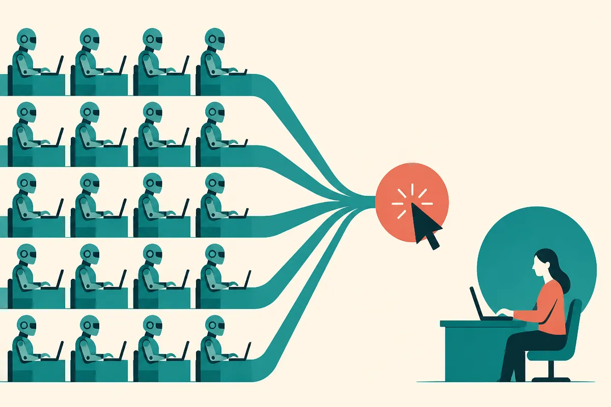
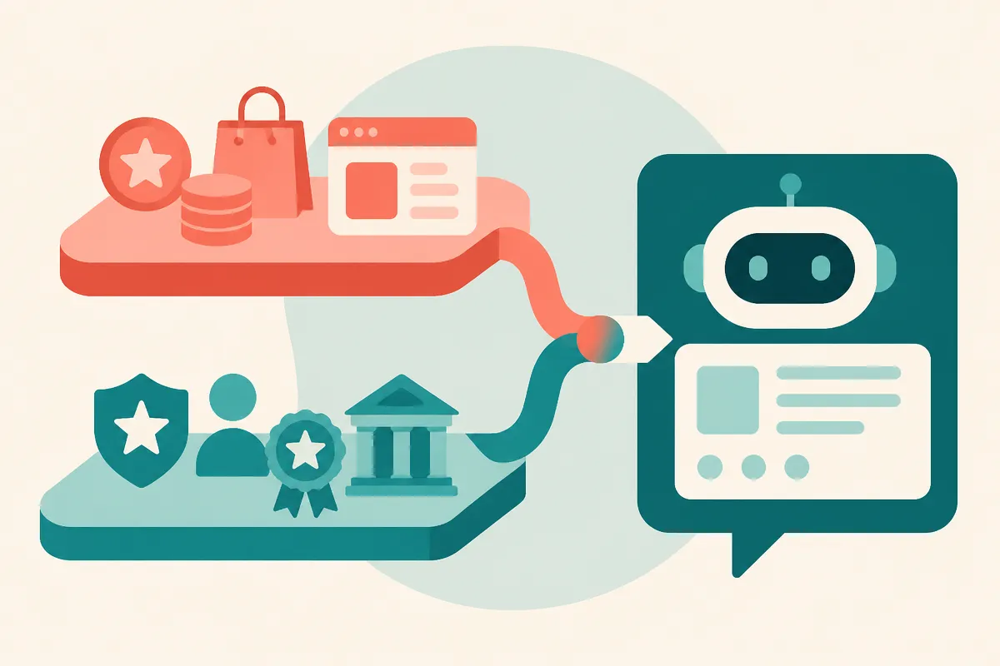

TL;DR: OpenAI is adding visual ads and better measurement to ChatGPT at the same moment a verification firm says its ad clicks look far more bot-heavy than Google's, so the smart move is to keep investing in answer visibility you own while treating paid ChatGPT inventory as an unproven test channel.

Two things happened in the same news cycle, and they belong together. OpenAI is pushing ChatGPT ads further into real ad territory with visual formats and more measurement partners. And TrafficGuard, an ad verification company, published an analysis saying ChatGPT ad clicks are far more likely to be bots than Google clicks are. One story is about ambition. The other is about whether the ambition has a traffic quality problem before it even scales. If you spend money or attention on getting found inside ChatGPT, you need both halves.

Let me map the whole thing: what OpenAI actually announced, what the bot data really says, why organic visibility still matters more for most operators, and what to watch next.

## What did OpenAI actually announce?

According to Search Engine Journal's coverage (OpenAI To Test Visual Ads In ChatGPT Image Generation, by Brooke Osmundson) and a parallel writeup from Martech (OpenAI adds visuals to ChatGPT ads), OpenAI is doing three things at once.

First, visual ads. The previous ad format leaned on simpler sponsored placements: an advertiser name, a logo, a product link. The new format lets advertisers use images to show products, how they are used, or experiences tied to a service. These visual ads will appear during image generation. Martech reports OpenAI says the ads stay separate from the image being generated and will not influence ChatGPT's answers.

Second, timing and scope. Per both outlets, this is a limited U.S. test running later this month with a group of advertisers. That is the important framing. It is a test, not a general rollout, and it is confined to one surface (image generation) in one country.

Third, measurement. OpenAI is expanding how advertisers can measure campaigns through integrations with Hightouch, Tealium, and LiveRamp to send conversion data into ChatGPT Ads, according to Martech. That is the less glamorous part and arguably the more telling one. You do not build conversion plumbing and third-party measurement hooks for a throwaway experiment. You build it because you intend to sell performance, and performance needs proof.

Martech also notes OpenAI says ChatGPT now reaches 1.2 billion people each week. That reach number is the whole business case. Visual ads are one more way to turn some of that activity into inventory.

This fits the pattern I have been tracking for a while. I called the earlier placements [a test channel, not a settled search replacement](/blog/2026-09-29-chatgpt-ads-look-like-a-test-channel-not-a-settled-search-replacement/), and nothing here changes that read. Richer creative and better measurement make the test more serious. They do not make it a finished search-ad business.

## Is ChatGPT's bot-click problem real?

Here is the part that should make any advertiser slow down. TrafficGuard, an ad verification company, analyzed three weeks of ChatGPT ad traffic from 47 advertisers. The findings, as reported by Martech, are specific enough to take seriously and early enough to treat as a first signal rather than a verdict.

The headline numbers, attributed to TrafficGuard: invalid click rates ranged from 0.1% to 34% across campaigns. Some campaigns were largely clean. Others paid for substantial traffic that, in TrafficGuard's words, had no chance of converting. A small number of bots drove much of the activity. TrafficGuard says 15 servers at one hosting provider clicked ads from five advertisers 318 times over the three weeks. Four hosting and proxy networks reached 25 of the 47 advertisers and generated half of all the invalid clicks it identified.

The comparison to Google is the sharpest claim. TrafficGuard found ChatGPT ad clicks were 3.6 times more likely than Google Ads clicks to come from datacenters or proxy networks, and 10 times more likely to come from devices with configurations that could not exist in the real world. TrafficGuard co-founder and CEO Mathew Ratty put it plainly in a statement: "Even though ChatGPT advertising is in its early days, automated traffic has already found it. It is coordinated, it is persistent, and it is clicking every day."

Treat this as reported, not confirmed. It is one verification vendor's analysis of a 47-advertiser sample over three weeks. OpenAI has not published a response to those figures in the material I have. Verification vendors also have an obvious interest in finding fraud, because finding fraud is their business. None of that makes the data wrong. It means you weigh it as a credible early warning from an interested party, not as a settled fact about the platform.

But the direction is believable. New ad surfaces attract fraud the moment they have money and immature defenses. That is the normal lifecycle, not a ChatGPT-specific flaw. The honest reading: the inventory is young, the detection is young, and some of the clicks you pay for in this phase will not be people.

## Why does organic visibility still matter more than ads here?

Because paid ChatGPT inventory is a test and organic answer presence is the actual game. If your brand does not show up when ChatGPT answers a real question, no ad budget fixes the underlying invisibility. I have argued this repeatedly: [selling on ChatGPT starts with answer visibility, not ad tactics](/blog/2026-09-15-selling-on-chatgpt-starts-with-answer-visibility-not-ad-tactics/).

The best supporting data here comes from a Martech piece on strengthening brand story for AEO (answer engine optimization). It cites a 2025 AirOps study of 21,311 brand mentions that found 85% of mentions in AI answers came from third-party sites, not the brands' own domains. Sit with that number. The overwhelming majority of what an AI assistant says about you comes from everywhere except your website. Your homepage is not where the model learns who you are. The web's description of you is.

That reframes the whole visibility problem. It is less "optimize my page" and more "shape the entity the model has already built about me." The Martech AEO piece frames your company as the "entity" and the surrounding web data as the "knowledge graph" of your industry. If your messaging across that graph is inconsistent, as the piece puts it, you pretty much do not exist for the AI tool.

There is a nice, replicable example in that same piece. Rand Fishkin of Sparktoro ran a 2025 experiment: his team used the phrase "makers of fine audience research software" in every bio, boilerplate, and description. He later found AI chat tools reproducing that exact phrase when describing Sparktoro. That is marketer influence on the knowledge graph, demonstrated, not theorized. You can test the same thing with your own tagline.

This connects to a few things I have written. The entity-level bias shows up before any query runs, which is why [ChatGPT's brand bias starts before search](/blog/2026-08-14-chatgpts-brand-bias-starts-before-search/). And the mechanism that decides whether you surface is increasingly about [evidence design across the web, not keyword placement on one page](/blog/2026-08-18-chatgpt-fan-out-queries-are-turning-seo-into-evidence-design/).

I run Lucky Domains, which does white-hat [SEO and search visibility work](https://luckydomains.io/services.html#seo), so I will be direct about the bias: I think the organic, own-your-presence side is where most operators get durable returns, and the ad side is where you experiment with a capped budget.

## How do paid and organic actually fit together now?

They are not competitors. They are two layers of the same visibility stack, and right now they are at very different maturity levels.

The paid layer is where OpenAI is moving the economics. I have written that ChatGPT ads [move the fight from keywords to intent](/blog/2026-10-05-chatgpt-ads-move-the-fight-from-keywords-to-intent/), because a conversation reveals what someone is actually trying to do in a way a search box rarely does. Visual ads during image generation extend that: if someone is generating product-style imagery, the intent signal is rich. The measurement integrations with Hightouch, Tealium, and LiveRamp are OpenAI trying to make that intent provable in conversion terms.

The organic layer is where the model decides whether to mention you at all, paid or not. That layer runs on the entity and the third-party evidence, per the AirOps 85% figure. No ad buy changes what the model believes about you between ad impressions.

Here is the throughline the two Martech pieces imply together. OpenAI is building a measurable ad business on top of a surface where, per TrafficGuard, click quality is currently shakier than Google's. Meanwhile the organic path to the same users depends on web-wide consistency that most brands have never deliberately managed. So the operator's job splits cleanly: spend small and measure hard on ads, and invest steadily in the brand story the model reads everywhere else.

This also rhymes with what is happening on Google. The spam update and AI Overviews turned out to be [the same SEO story](/blog/2026-08-22-googles-spam-update-and-ai-overviews-are-the-same-seo-story/): the engine is rewarding genuine substance and penalizing thin content, whether it answers in a snippet or a chat. Different platform, same underlying demand for real evidence.

## How do you measure any of this when attribution is broken?

This is the quiet crisis under both stories. OpenAI is adding conversion measurement precisely because measurement is the hard part. And the whole reason AEO is tricky is that [AI search turns attribution into the real SEO problem](/blog/2026-08-29-ai-search-is-turning-attribution-into-the-real-seo-problem/). When a model mentions your brand inside an answer and the user acts later, no clean referral trail connects the two.

So you measure in two registers.

For paid, use the plumbing OpenAI is offering, but verify the inputs. The TrafficGuard analysis is the cautionary note: if a third of your clicks in a given campaign can be invalid, raw click and conversion counts will mislead you. Run your own invalid-traffic checks. Watch for the datacenter and proxy signatures TrafficGuard describes. Compare cost-per-genuine-action, not cost-per-click, against your other channels. If a vendor-reported invalid rate as high as 34% shows up in your own logs, that is your signal to pause and investigate, not to scale.

For organic, measure presence directly. Query ChatGPT and other assistants with the questions your buyers actually ask and record whether you appear, how you are described, and which third-party sources the model leans on. The Martech AEO piece lays out the workflow: audit where your brand appears across the web, fix the places where the story is wrong or inconsistent, update your controlled touchpoints (website, bios, PR templates, pitch decks), and request edits from publishers whose pages the model cites. You will not fix the one guy in a Reddit thread, but editors often update older pages when asked.

One more measurement discipline, borrowed from a fourth Martech piece on evaluating AI advice. It offers a test I like for this whole space: does a claim diverge wildly from consensus without explaining why, and can someone else replicate the result? Apply that to the visual-ads hype and the bot-panic alike. The Fishkin boilerplate experiment passes: it is replicable, you can run it tomorrow. A breathless "ChatGPT ads will replace Google" claim does not pass, because nobody can hand you a repeatable playbook for it yet.

## What should an operator do right now?

Concretely, for the next quarter:

Keep ChatGPT ads on a small, capped test budget. The format is new, the measurement is improving, and the traffic quality is, per TrafficGuard, not yet proven to match Google's. That is a test posture, not a core-channel posture.

Instrument before you spend. Set up invalid-traffic monitoring on any ChatGPT ad campaign from day one. You want to know your own bot rate, not a vendor's sample rate.

Put the real effort into the entity. The AirOps figure (85% of AI brand mentions from third-party sites) tells you where the leverage is. Define your "why," audit your mentions, standardize your boilerplate, and get consistent wording onto the sites the model actually reads. That is the work that pays off across every assistant, not just ChatGPT.

Measure presence, not just clicks. Track whether and how you appear in AI answers as a standing metric, the way you track rankings.

Watch the plumbing more than the pixels. The Hightouch, Tealium, and LiveRamp integrations tell you more about OpenAI's intent than the visual format does. This connects to the broader play where [OpenAI's small business push is really a workflow bet](/blog/2026-07-22-openais-small-business-push-is-really-a-workflow-bet/): the company wants to own the full loop from attention to conversion, and measurement is how it proves that loop works.

## What to watch next

Three things will tell you where this goes.

Does OpenAI respond to the fraud data? If OpenAI publishes invalid-traffic rates or builds visible fraud controls into ChatGPT Ads, that is a sign it is taking the quality problem seriously enough to scale the business. Silence, or a general rollout without addressing click quality, is a yellow flag. As of now I have no OpenAI response to the TrafficGuard figures in the sources.

Does the test expand past image generation and the U.S.? Right now this is one surface, one country, a group of advertisers. A broader rollout would mean OpenAI is satisfied with the economics. Keep treating it as a test until it clearly stops being one.

Does the entity layer get harder to influence? The Fishkin experiment worked in 2025. As models retrain and detection of coordinated phrasing improves, blunt boilerplate repetition may lose force and genuine, distributed evidence may matter more. That is the direction I would bet on, and it rewards operators who build real reputation over those gaming a phrase.

Here is the forward judgment no single source gives you. OpenAI is building the ad business and the measurement stack in the right order, but it is building on traffic whose quality, per one credible verification vendor, is not yet where Google's is. That gap will either close fast, because OpenAI has every incentive to close it, or it will quietly cap how much serious performance spend flows in. Either way, the operator who invested in owned answer visibility during the test phase is insulated from the outcome. You cannot be defrauded on an impression you earned instead of bought.

Practitioner's take: run the Fishkin test this week. Pick one precise phrase that describes what you do, put it in every bio, boilerplate, and description you control, and in a month ask three assistants to describe your company and see if the phrase comes back. That single experiment teaches you more about AI visibility than any ad test, and it costs nothing. The catch most readers miss: the visual-ads news is the loud story, but the quiet AirOps number (85% of your AI reputation lives on sites you do not own) is the one that should actually change your Monday. Fix the places the model reads about you before you pay the model to show your logo.
