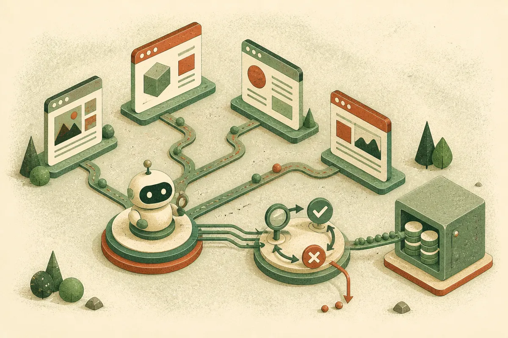

TL;DR: CLIFT’s useful idea is not “agents can judge themselves,” it is “agents can reuse certified self-checks so training and test-time selection need fewer external judge calls.”

## What problem is CLIFT actually solving?

The primary source here is the arXiv paper titled **“CLIFT: Conformal Self-Verification for Web Agent Training and Test-Time Scaling.”** The paper targets a very specific web-agent bottleneck: reinforcement learning on browser tasks needs feedback, but the usual feedback is either too weak or too expensive.

Binary task success is thin. If an agent fails to book the right thing, update the right field, or reach the right page, a single fail signal does not tell it which step went wrong. Frontier model judges can provide richer feedback, but calling them at every step is costly and may not be available when the deployed agent is running.

CLIFT’s answer is conformal self-verification. During training, the agent answers natural-language verification questions about its own rollouts. Then a Compositional Conformal Certifier keeps only the question signals whose URL-conditional evidence agrees with a training-time judge. It also assigns signed trust weights through polarity-aware lift and blends that verifier score into per-step rewards.

The key guardrail: CLIFT does this “in a way that never subtracts from the judge baseline,” according to the paper. That matters. Self-evaluation is notorious for grading its own homework. CLIFT is not asking us to blindly trust the model’s internal story. It uses a judge during training to certify which self-checks are useful, then banks those checks for later.

## Why does the test-time part matter?

The cleaner part of CLIFT is what happens after training. The certified question bank is frozen and reused for Conformal Trajectory Selection, or CTS. At test time, the agent samples a greedy rollout plus one or more diverse retries. The self-verifier summarizes each URL trace. A conservative majority-vote rule decides whether to swap away from the current incumbent trajectory.

Translation: instead of asking a big external judge which browser attempt is best, CLIFT uses a pre-certified set of checks to compare attempts. That is test-time scaling without the normal tax of judge calls.

This is a practical pattern. Generate multiple attempts, inspect them with structured criteria, only switch when the evidence is strong enough. Not glamorous. Very useful.

The paper reports three settings. On WebArena Infinity, CLIFT reaches state-of-the-art performance among open-source web agents. On VisualWebArena, a bank trained with the open model transfers to GPT-5.5 at test time and reaches state-of-the-art performance under the canonical harness. On Online Mind2Web, translating the certified question bank improves a live-web agent in zero-shot evaluation without training the agent on that benchmark.

Those are strong claims, but the supplied material does not include the numeric margins, model sizes, cost comparisons, or failure breakdowns. So I would treat this as promising architecture, not a solved-agent victory lap.

## What should builders copy from CLIFT?

The lesson is not that every product agent needs conformal prediction machinery tomorrow. The lesson is that “self-checking” gets more credible when it is calibrated against real evidence and reused in a controlled way.

For a browser agent, customer-support agent, coding agent, or ops agent, you can adapt the pattern:

Train or tune against a trusted evaluator when you can. Convert that evaluator’s judgments into reusable verification questions. Attach those checks to states that matter, such as URLs, files, database records, or workflow stages. At runtime, sample more than one path only when the task is high-value enough to justify it. Pick a different path only when your verifier has a clear reason.

That is the operator version of CLIFT. Spend expensive judgment once. Cache the right kind of evidence. Use it to make future decisions cheaper.

The catch most readers miss: verification questions become part of the product surface. If they are too generic, the agent will rationalize bad work. If they are too narrow, they will not transfer. I would start by logging real failures, writing plain-English checks for the steps that caused them, and testing whether those checks predict success before wiring them into rewards or trajectory selection.
