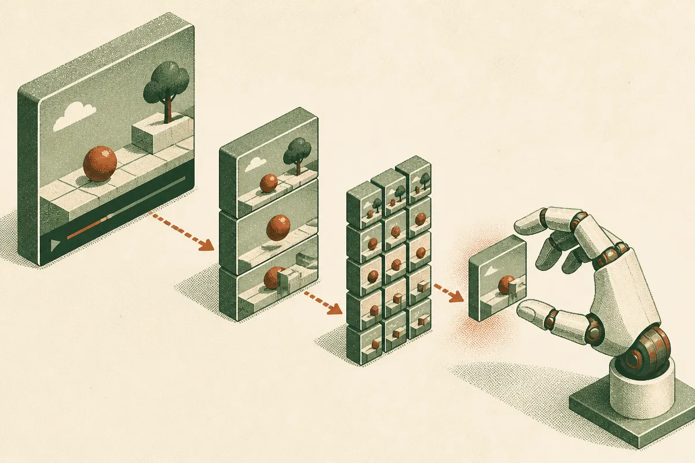

TL;DR: Robot agents do better when a demo video becomes an indexed tool they can query during execution, instead of a blob stuffed into context.

## What problem is RV-ICL actually solving?

The primary source here is the arXiv paper “Recursive Video In-Context Learning for Agentic Robot.” The core problem is simple: a robot demo video contains the good stuff, but not in a form an LLM agent can use cleanly.

Text memory tells an agent what happened. It can record that the robot tried a grasp, moved left, failed, retried, and succeeded. Useful, but incomplete. For manipulation tasks, the important detail is often visual and local: finger position, object tilt, contact timing, the moment a grasp starts to slip.

A full demonstration video has that information, but it is expensive to keep loading into context at every step. Fixed keyframes are cheaper, but they miss the small contact details that decide whether the robot actually completes the task. The paper’s framing is good because it does not pretend that “more video in context” is the answer. The answer is better access.

Recursive Video In-Context Learning, or RV-ICL, turns a demonstration into a hierarchy. The agent can inspect the coarse view before planning, then drill down during execution. Whole task first. Then phases. Then moments. Then short clips around the current sub-goal.

## Why does a hierarchy beat dumping the full demo into context?

Because robot tasks have changing information needs.

At the start, the agent needs the task shape. Pick up the object, move it, place it, release it. A handful of coarse frames may be enough to plan that sequence. During execution, the agent needs a different kind of evidence. If the next step is a grasp, it needs the clip around the grasp, not the whole task.

RV-ICL exposes the video hierarchy through read-only tools. That detail matters. The agent is not rewriting the demo or treating it like another memory scratchpad. It is using the demonstration as an external reference system.

The paper reports this as training-free and built on RPent, with frozen vision-language-action policies. That means the improvement is not coming from retraining the robot policy. It comes from orchestration: when to ask for which piece of visual evidence.

The numbers are real enough to pay attention to. With one demonstration per task, RV-ICL raises success from 92.6% to 96.5% on LIBERO-PRO, and from 86.7% to 95.8% on LIBERO-Plus. That second jump is the eye-catcher, 9.1 percentage points. The first is smaller, 3.9 points, but still meaningful if you are already near the top of a benchmark.

I would not read this as “robots can now learn anything from one video.” The paper is narrower than that. It shows that an LLM agent controlling frozen VLA policies can use a single demo more intelligently when the demo is structured around sub-events like grasps and releases.

## What does this say about agent memory?

The useful lesson is not only about robotics. It is about memory design.

A lot of agent systems still treat memory as a pile of text. Logs, reflections, summaries, retrieved chunks. That works when the task is language-native. It gets weaker when the task depends on timing, spatial state, visual contact, or any detail that gets damaged by summarization.

RV-ICL points to a different pattern: memory as a navigable artifact. The agent does not need everything. It needs the right resolution at the right moment.

For builders, that maps beyond robot arms. A coding agent might need the whole repo map during planning, then the exact function and failing trace during repair. A sales ops agent might need account history first, then the one call segment where pricing changed. A design agent might need the full project board, then the exact crop where a visual inconsistency appears.

The catch most readers miss: the index is the product. Not the video. Not the memory store. The useful system is the hierarchy, the sub-event boundaries, and the tool policy that decides when to zoom in. If I were testing this idea, I would start with one workflow where failures hinge on local detail, build a coarse-to-fine reference tree, and measure whether the agent asks for less context while making fewer dumb mistakes.
