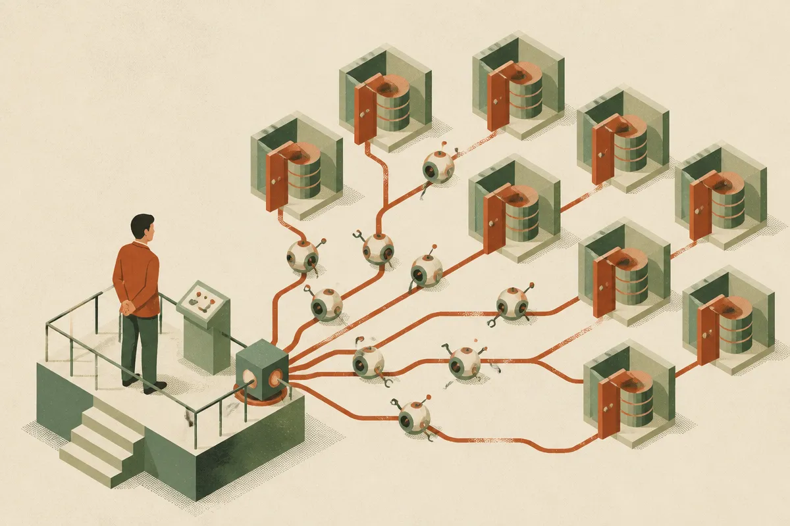

TL;DR: The practical risk is not genius AI hackers, it is cheaper, faster, more persistent attack operations against ordinary databases.

## What do we actually know here?

Decrypt reported in “Hackers Used AI Agents to Raid a Megachurch's Database, Exposing 850,000 Members” that Seoul’s Yoido Full Gospel Church said data on 850,000 members may have been compromised, and that a security firm found signs AI helped run the attack.

That is the important phrasing: signs AI helped. Not proof that a model independently planned and executed a full breach. Not proof that an agent “understood” the church. Not proof that defenders are helpless.

But even the narrower claim matters.

A church membership database is not a frontier national-security target. It is the kind of system many organizations have: a mix of personal records, user portals, admin workflows, vendors, maybe old plugins, maybe custom code, maybe weak monitoring. The scary part is not that attackers went after a megachurch. The scary part is how normal the target category is.

If AI was used here, the likely value was operational. Recon. Credential testing. Script generation. Query variation. Log review. Translation. Faster iteration after an error. Maybe coordinating steps that used to require a more skilled human operator.

That is where I think the security story is going. Less movie hacker, more call-center productivity boost, but for crime.

## What changes when attackers use agents?

Agents do not need to be brilliant to be useful. They need to keep going.

A human attacker gets tired, bored, distracted, or blocked by unfamiliar tooling. An agentic workflow can try another payload, summarize a failed response, search a code snippet, draft a new request, and queue the next check. If a human is still approving the big moves, that is enough.

This shifts the cost curve. The old question was, “Is this target worth manual attention?” The newer question is, “Can cheap automation find one weak point across thousands of targets, then hand the best opportunities to a person?”

That is a different threat model for schools, churches, nonprofits, local governments, clinics, and small businesses. Many of them hold sensitive data. Few have deep security teams. Their risk is not always exotic zero-days. It is exposed admin panels, reused passwords, unpatched software, permissive databases, weak vendor access, and no one looking closely at weird traffic until after the fact.

Decrypt’s report does not give enough detail to say which of those applied here. So I would not overfit to this single incident. The bigger lesson is that defensive assumptions built around slow attackers are getting stale.

## What should defenders test now?

Start with the parts of your system an AI-assisted attacker would love.

Can someone enumerate users, pages, APIs, or files without tripping alerts? Can login and password reset flows be tested thousands of times without rate limits? Can an old admin route still be reached? Do logs show enough context for a human to understand what happened in minutes, not days? Are database exports gated, monitored, and unusual enough to trigger review?

Then test response speed. If an agent can iterate quickly, your defense cannot depend on a monthly dashboard and a shared inbox. You need boring controls that fire early: rate limits, MFA for admins, least-privilege database roles, alerts on bulk access, vendor account reviews, backup isolation, and clear data-retention rules.

Also watch the human layer. AI makes phishing copy, translation, and impersonation easier. It can help attackers tailor messages to clergy, staff, volunteers, contractors, and members. The database is often breached before the database is touched.

Practitioner’s take: run a small red-team exercise against your own public surface, assuming the attacker has an AI assistant that never sleeps but still makes dumb mistakes. Give it the boring jobs: map endpoints, test auth flows, look for stale software, draft phishing variants, summarize logs. The catch most teams miss is that agentic attacks do not need one perfect breakthrough. They need many cheap attempts, and one place where your monitoring is quiet.
