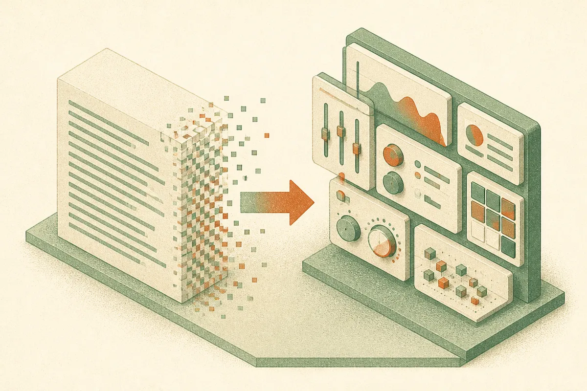

TL;DR: OpenAI is rolling out GPT-6 in ChatGPT with what it calls Intelligent UI, meaning the model can generate visuals and interactive elements inside your chat, but the announcement is long on vibes and short on the specifics a builder needs before wiring it into anything.

Let me name the source plainly, because the detail here is thin. The only first-party claim is the OpenAI blog post titled "GPT-6 and Intelligent UI for everyone," which says GPT-6 is rolling out globally in ChatGPT with Intelligent UI, "delivering faster responses with visuals and interactive experiences you can explore and use directly." Hacker News picked it up under the same title. That is the full extent of the confirmed material. No pricing, no rate limits, no API timeline, no benchmark numbers, no model card. So this post is about what the announcement actually says, what "Intelligent UI" probably means in practice, and how to think about it without getting ahead of the evidence.

## What is Intelligent UI, really?

Strip the branding and Intelligent UI appears to be one idea: the model stops answering only in text and starts rendering the interface along with the answer. Ask about a mortgage and instead of a wall of paragraphs you get a slider you can drag. Ask to compare three options and you get a sortable layout rather than a markdown table you squint at.

This is not a brand new concept. We have seen generative UI appear in pieces already: Anthropic's Claude Artifacts render working components, Vercel's v0 generates front-end code from prompts, and various agent frameworks have experimented with letting a model emit UI rather than prose. What OpenAI is claiming, based on the blog language, is that this happens natively inside ChatGPT for everyone, not as a separate tool you opt into. "Visuals and interactive experiences you can explore and use directly" is the operative phrase. The model is both the brain and the renderer.

The honest caveat: OpenAI's post does not explain the mechanism. We do not know if GPT-6 is emitting structured UI descriptions that ChatGPT's client renders, generating live code in a sandbox, or picking from a library of pre-built widgets. Those are three very different architectures with very different reliability profiles, and the announcement picks none of them for us. Anyone telling you which one it is right now is guessing.

## What did OpenAI actually confirm?

Here is the discipline I want to hold. OpenAI confirmed three things in its own words: GPT-6 is "rolling out globally in ChatGPT," it includes Intelligent UI, and the pitch is "faster responses with visuals and interactive experiences." That is it.

Everything a builder actually cares about is absent from the sources I have. There is no stated API availability, so I will not claim you can call this from code yet. There is no pricing or usage tier, so I will not tell you it is free, metered, or Pro-only. There is no latency figure behind "faster responses," no supported-surfaces list (web, mobile, desktop), and no word on whether the interactive elements can call tools or just display state. "Rolling out globally" also does not mean "live for your account today." Staged rollouts are OpenAI's normal pattern, and the post gives no date or cohort detail.

If you see a thread claiming GPT-6 beats some benchmark or ships at a specific price, check whether that number traces back to this announcement. From what I was given, it cannot, because the announcement contains no numbers at all.

## Why would a generated interface matter to builders?

Assume the feature works as described. The interesting shift is not "prettier chat." It is that the unit of output changes from a block of text to a small, disposable application. That has real consequences for how people work.

For anyone building on top of ChatGPT, a model that renders interactive controls could collapse steps that currently need a front-end. Instead of asking GPT to produce JSON that your app turns into a form, the model produces the form. Instead of describing a chart, it shows a manipulable one. For internal tools, quick calculators, data exploration, and one-off dashboards, that is genuinely useful because the throwaway UI was always the expensive part.

But the reliability questions get harder, not easier, when the model controls the interface. A hallucinated sentence is easy to spot. A slider wired to the wrong variable, or an interactive comparison that silently drops a row, is not. When the model renders the thing you act on, every UI it generates needs the same scrutiny you would give its text, except now the errors are hidden behind controls that look authoritative. "Looks like a working app" and "is a correct working app" are not the same claim, and generated interfaces are very good at the first one.

There is also a lock-in angle worth flagging. Native Intelligent UI inside ChatGPT is, by definition, inside ChatGPT. If your workflow depends on the model rendering its own interface, you are tied to OpenAI's surface in a way that plain text output never locked you in. Text ports anywhere. A proprietary interactive experience does not.

## How should an operator treat this today?

Treat it as a preview to test, not a dependency to build on. Until OpenAI publishes API access, pricing, and some reliability detail, this is a consumer ChatGPT feature, and consumer features change without warning.

If it reaches your account, the useful experiment is narrow: take three tasks where you currently copy model output into a tool, a quick calculation, a comparison, a small data view, and see whether the generated UI is correct, not just whether it is slick. Push a value through a generated slider and check the math by hand. Sort a generated table and confirm nothing vanished. The demo will look great. Your job is to find where it lies.

And hold the line on what is confirmed. We have a blog post with a product name and a one-line pitch, nothing more. GPT-6 existing as a shipped model in ChatGPT is a real event if the rollout is what OpenAI says it is. Intelligent UI being reliable enough to trust with real decisions is a separate question the announcement does not answer, and the gap between those two is exactly where most of the hype is going to live this week.

The catch most readers will miss: a model that renders its own interface moves the error from the sentence, where you can read it, to the control, where you can only feel it when the output is already wrong. Verify the generated UI as hard as you verify the generated text, because it is the same model making both and it is better at looking right than being right.
