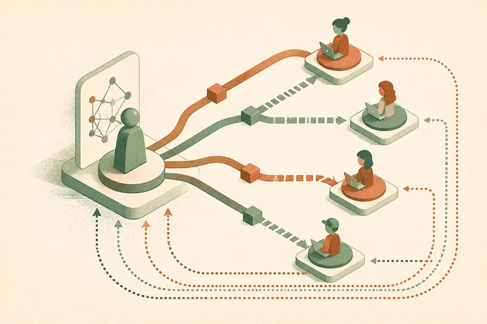

TL;DR: Sherpa’s useful idea is not “AI tutor gets smarter,” it is training the tutor against student learning gains instead of generic ideas of what good teaching sounds like.

## What is Sherpa actually optimizing?

The primary source here is the arXiv paper titled “Sherpa: Teaching LLMs to Teach Adaptively,” listed under cs.AI and cs.CL. The core claim is simple and important: an LLM that can solve a math problem is not automatically good at teaching that problem.

That sounds obvious if you have ever watched a brilliant engineer explain something to a beginner. Correct answer, bad path. Too much abstraction. Too little diagnosis. No check for the student’s misconception.

Sherpa tries to train the model on a different target. Instead of relying only on demonstrations, preference data, or fixed teaching rubrics, it sets up multiple LLM-based student archetypes, each conditioned on different learning preferences. Then it trains a teacher model with multi-turn reinforcement learning to improve those students’ learning outcomes.

That shift matters. The reward is not “did the answer look pedagogically nice?” It is closer to “did this kind of student get better after the interaction?”

The reported gains are meaningful on their face. Sherpa-trained teacher LLMs improved instructed student performance across all archetypes by an average of 20.5 percentage points. On MathTutorBench, the pedagogy score rose from 52.5% to 79.2%. In human studies, people preferred the trained teacher over the base model in 79.6% of pairwise comparisons.

Those are strong numbers. Also, they are still numbers inside a research setup.

## Why simulated students are both the trick and the trap

The clever part of Sherpa is simulation. Real students are expensive, slow, diverse, and ethically messy to train against directly. Simulated students let researchers run many tutoring loops, test adaptation patterns, and generate reward signals at scale.

That is also the weak spot.

An LLM pretending to be a confused student is not the same thing as a ninth grader who is tired, embarrassed, overconfident, distracted, or missing prerequisite knowledge from two years ago. Student archetypes are useful scaffolds. They are not reality.

So I would not read Sherpa as “we solved AI tutoring.” I would read it as a better training recipe. The important move is to model different learner needs and optimize for improvement over multiple turns. That is closer to real tutoring than one-shot answer generation, and it is more grounded than asking annotators whether a tutor response sounds friendly and clear.

There is another catch. If the simulated students are too easy to help, the teacher may learn strategies that work inside the simulator and fall apart with humans. If the archetypes are too narrow, the tutor can become very good at adapting to the wrong set of learners. This is the same old eval problem, wearing a classroom badge.

Still, this is the direction I want to see: not more polished explanations, but better feedback loops.

## What should AI education builders copy from this?

The practical lesson is not that every edtech team needs to reproduce Sherpa’s full reinforcement learning setup tomorrow. Most will not have the model access, evaluation stack, or research budget.

But the design pattern is portable.

Start by separating “knows the answer” from “teaches the learner.” Then build your product evals around student state changes. Did the learner identify the misconception? Did they solve a near-transfer problem after the hint? Did they need less help on the next turn? Did the tutor adapt after a wrong answer, or just rephrase the same explanation?

That is more work than counting correct completions. It is also closer to the job.

Sherpa also argues for persona-based testing, as long as nobody confuses personas with proof. A builder could create a small panel of simulated learners: one who wants step-by-step guidance, one who guesses quickly, one who needs visual intuition, one who has a specific misconception. Run every tutor change against that panel. Then compare it with real learner outcomes when possible.

Practitioner’s take: if I were building an AI tutor, I would steal Sherpa’s measurement philosophy before its training method. Pick one narrow topic, define three learner archetypes, create a pre-test and post-test, and judge the model on improvement after a multi-turn session. The catch most teams miss: nicer explanations can score well with adults reviewing transcripts while doing very little for the student who is actually stuck.
