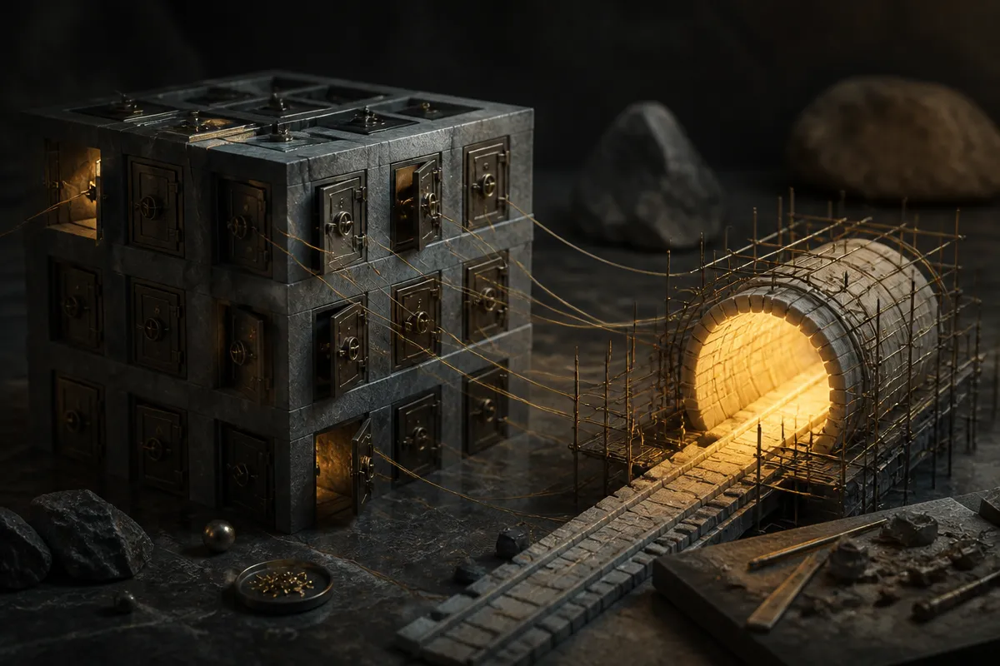

TL;DR: Treat “AI could break crypto encryption” as a reason to plan cryptographic migration paths now, not as proof that wallets, chains, or assets are suddenly unsafe today.

## Is AI actually about to break crypto encryption?

The clean answer: not from the evidence in the supplied material.

The primary source here is Decrypt’s reporting in “Will AI Break Crypto Encryption? Ethereum’s Vitalik Buterin Weighs In on 'Bunker Mode' Shift” and “Morning Minute: AI Could Break Crypto Encryption Before Quantum, Says Ethereum Researcher.” Decrypt reported that Vitalik Buterin thinks the crypto industry should make sure encryption is both quantum and AI-resistant. Decrypt also reported that Ethereum researcher Justin Drake is calling for crypto holders to start calmly planning for “Bunker Mode,” while reactions have been less calm.

That framing matters. There is a big difference between “AI broke cryptography” and “AI changes the risk model around cryptographic systems.”

Modern AI systems are already useful at code review, fuzzing, exploit discovery, protocol analysis, and glue-work across messy software stacks. That is real security pressure. If a wallet implementation has a bad random number generator, a signing bug, a leaky browser extension, or sloppy key handling, AI-assisted attackers can make those weak points cheaper to find and exploit.

But that is not the same as a model magically cracking strong public-key cryptography. Most crypto systems depend on hard math, protocol assumptions, implementations, and human operations. AI stress hits the last three first.

Quantum is the cleaner long-term cryptographic threat. Large fault-tolerant quantum computers would create known problems for widely used public-key schemes. AI is murkier. It may accelerate cryptanalysis. It may discover implementation breaks. It may help attackers chain together boring flaws at scale. But the supplied reporting does not establish that AI systems can currently defeat the cryptography securing Ethereum wallets.

## What would “Bunker Mode” mean in practice?

The phrase is useful if we keep it boring.

A credible bunker mode is not a vibes-based emergency button. It is a set of pre-agreed fallback moves: which signature schemes to migrate toward, how users prove ownership during a transition, how apps handle old keys, how custody providers rotate infrastructure, how exchanges and bridges coordinate, and what happens when some users do nothing.

That last part is always the hard part.

Crypto is bad at coordinated upgrades because the users are the infrastructure. A bank can rotate systems behind the scenes. A chain has wallets, smart contracts, hardware devices, multisigs, cold storage, bridges, L2s, exchanges, indexers, auditors, and users who lost their seed phrase three laptops ago.

If “Bunker Mode” only means “we should adopt post-quantum cryptography someday,” it is not enough. If it means “we should simulate an emergency migration before one is needed,” that is more interesting.

The AI angle makes this more urgent in a specific way. It compresses attacker labor. A vulnerability class that once required rare expertise may become scriptable. That does not break the math, but it does change the economics. Security plans built around “this is too annoying to exploit at scale” age poorly when agents can run cheap reconnaissance all day.

## The part the market will probably get wrong

The bad version of this story is predictable: AI panic, quantum panic, token narratives, security theater, and projects branding themselves “AI-resistant” without showing the migration mechanics.

I am not making any claim about asset prices, and nobody should treat this as a buy, sell, or hold signal. The operator question is simpler: can the system rotate cryptographic assumptions under pressure?

For builders, the practical move is to inventory key dependencies now. Which signature schemes do you rely on? Which wallets and custody paths would need upgrades? Which contracts hard-code assumptions? Which users could be migrated safely, and which would be stranded? Then run a tabletop exercise: assume a credible break is announced, not total chain death, but enough to force rotation. Who communicates? What gets paused? What proof is accepted? What cannot be fixed?

The catch most readers miss: cryptographic resilience is less about picking the perfect future algorithm and more about designing systems that can change algorithms without chaos. AI may or may not be the thing that forces the migration. The migration problem is real either way.
