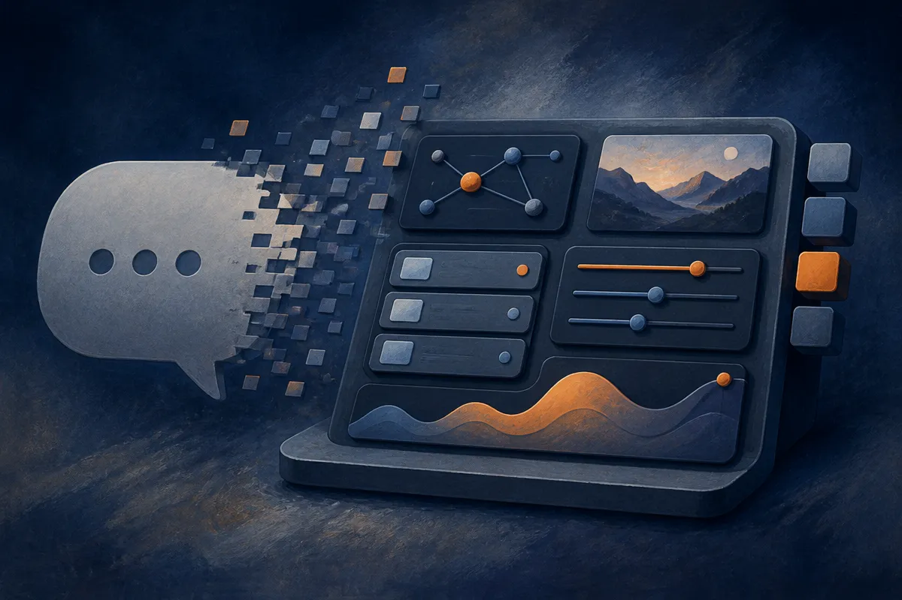

TL;DR: GPT-6 Intelligent UI is ChatGPT moving from text answers toward on-demand mini interfaces, useful when the interface clarifies the task and risky when it hides weak reasoning behind nicer controls.

## What did OpenAI actually ship?

The primary source here is OpenAI’s announcement, “More visual answers from GPT-6 with Intelligent UI.” OpenAI says GPT-6 in ChatGPT now includes Intelligent UI, a capability that lets ChatGPT respond with fully interactive user interfaces, not just paragraphs, tables, or static charts.

That matters because the unit of output changes. A response can become a calculator, a visual explainer, a picker, a comparison widget, or a small task-specific tool created in the moment. OpenAI frames this as a way to make everyday answers more visual, help people learn complex topics, and build a quick tool for the job at hand.

OpenAI also says GPT-6 with Intelligent UI has already rolled out globally to ChatGPT Plus, Pro, Business, and Enterprise in the Chat tab, and is now expanding to Free and Go tiers. Enterprise access depends on workplace admin settings. The company says Plus, Pro, Business, and Enterprise use GPT-6 Sol, while Free and Go use GPT-6 Luna. Both are tuned for everyday conversation.

One important boundary: OpenAI says this update applies to the Chat experience. The models powering Work and Codex are not changing as part of this release.

Search Engine Journal’s Matt G. Southern covered the rollout as “ChatGPT Gets GPT-6 And Intelligent UI For Interactive Answers,” which is a reasonable headline. But I think the more useful read is narrower: this is not just “more visual answers.” It is ChatGPT trying to decide when a user needs an interface instead of another block of prose.

## When is an AI-generated interface better than text?

Text is still underrated. For many tasks, a direct answer beats a widget. If I ask for the capital of Kenya, do not give me a draggable globe.

But there are real cases where an interface is the answer. Learning fractions. Comparing mortgage scenarios. Planning a workout. Sorting travel options. Debugging a small dataset. Choosing between pricing packages. Any task where the user needs to manipulate inputs, see relationships, or test “what if” changes benefits from a UI.

This is where Intelligent UI gets interesting. The model is not only generating content. It is choosing a temporary product shape around the content. That is a different skill.

The catch is that UI can make an answer feel more trustworthy than it is. A polished interactive chart can still be based on bad assumptions. A slider can hide missing variables. A calculator can look official while encoding the wrong formula. The interface adds clarity when the logic is right. It adds confidence theater when the logic is weak.

So the evaluation question changes. We should not only ask, “Did GPT-6 answer correctly?” We should ask, “Did the interface expose the reasoning, inputs, and limits clearly enough for a user to catch mistakes?”

## What does this mean for builders?

This is another sign that AI product design is collapsing into runtime. Instead of designing every screen in advance, builders will increasingly design rules for when screens should exist.

That does not mean apps go away. Durable workflows still need permissions, saved state, audit trails, integrations, billing, analytics, and error handling. ChatGPT creating a quick interface is not the same as shipping a product.

But it does raise the floor for internal tools and lightweight workflows. A support lead might ask for a refund triage view. A teacher might ask for an interactive quiz on today’s lesson. A marketer might ask for a campaign calculator. A founder might ask for a quick vendor comparison tool. If the interface appears instantly inside the chat, a lot of “we should build a small tool for that” work becomes disposable.

The operator move is to test Intelligent UI on tasks where text outputs already create friction. Pick three recurring workflows with inputs, tradeoffs, or comparisons. Ask GPT-6 for the answer in normal prose, then ask it to turn the same job into an interactive tool. Compare accuracy, speed, and user comprehension. The catch most readers will miss: the win is not prettier answers. The win is finding which decisions deserve a temporary interface, and which ones still need boring, auditable text.
