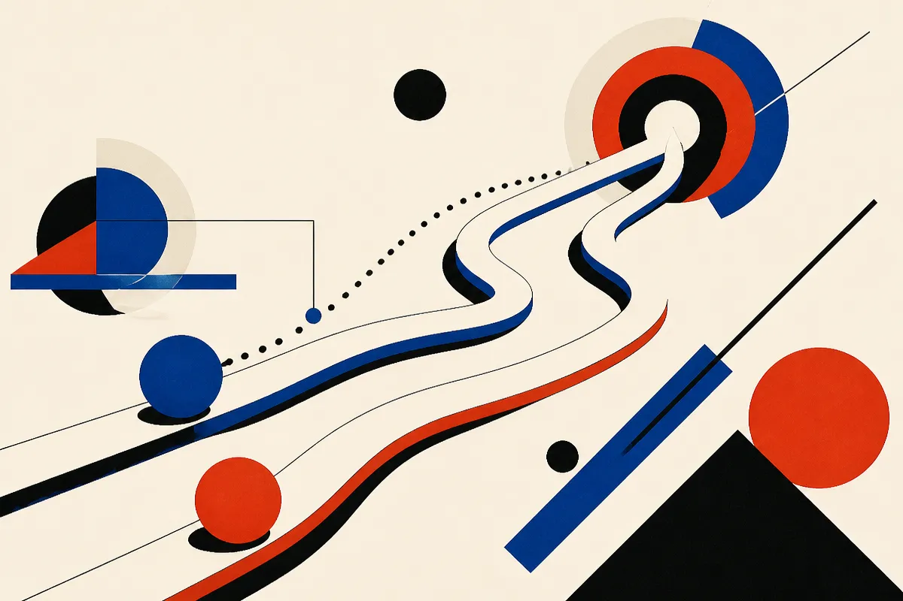

TL;DR: JOLT’s useful idea is that self-teaching only helps when the teacher’s guidance is matched to what the student can actually learn from its own current behavior.

## What problem is JOLT trying to fix?

The primary source here is the arXiv paper **“A Good Self-Teacher Meets the Student Where They Are: Joint On-Policy Learning and Teaching”**, listed under cs.AI and cs.LG.

The problem is familiar if you have tried to train models on long tasks. Outcome rewards are sparse. A coding agent either passes the tests or it does not. A terminal-use agent either completes the task or it does not. A math solution either lands on the right answer or misses. That final signal is useful, but it is a weak teacher for the thousands of small decisions that got the model there.

On-Policy Distillation, or OPD, tries to fix that by giving token-level supervision from a stronger teacher along the student’s own generations. That matters. The teacher is not grading some idealized clean solution. It is responding to what the student actually produced.

JOLT pushes this one step further. Instead of needing a separate stronger model, it trains a single policy in two roles: a privileged teacher and an unprivileged student. The privileged teacher gets extra information. The student does not. The student learns through dense on-policy distillation from the teacher.

That sounds neat, but the paper’s central point is the catch: privileged information can make the teacher worse as a teacher.

Not worse at the task. Worse at helping this student improve.

## Why can a stronger teacher make the student worse?

Because a teacher with privileged context can solve the task through a route the student cannot follow.

That is the underrated failure mode in a lot of distillation talk. We tend to ask whether the teacher is better. JOLT asks a more useful question: does the teacher’s update point in the same direction as the student’s reward gradient?

The paper derives a necessary and sufficient condition for the teacher’s local distillation update to be a positive multiple of the student’s reward gradient. Put plainly: the token-level advice should move the student in the direction that reward learning would have moved it, not just imitate a smarter behavior that came from unavailable shortcuts.

That framing is valuable outside the paper. In applied AI work, “better” help is often worse if it skips the learner’s bottleneck. A senior engineer can paste a perfect patch that teaches a junior engineer nothing. A coding model with hidden test insight can produce actions that look brilliant but do not train the base policy to reason from normal inputs. A tool-use agent with extra state can demonstrate a path the deployed agent will never be able to reproduce.

JOLT’s answer is not to remove the privileged teacher. It regularizes the teacher toward the student using token-level KL while still training it with outcome rewards. So the teacher is pushed to be good, but also to stay close enough to the student’s current behavior that its guidance is usable.

## What does this mean for post-training agents?

The paper reports gains across mathematical reasoning, coding, tool use, and terminal use, with further gains when student rewards are added. The abstract does not give enough detail to judge the size, benchmark mix, or failure cases, so I would not overread it. The important part is the training shape.

This is a post-training pattern worth watching: dense supervision, generated on the student’s own trajectories, constrained so the teacher does not drift into an unreachable strategy. That is directly relevant to agent training, where the hard part is not one answer token, but long sequences of fragile decisions.

It also hints at a broader evaluation lesson. If you only measure teacher quality by task success, you miss whether the teacher produces teachable traces. For builders, that may matter more than leaderboard rank. A slightly less capable guide that improves the deployed student can beat a brilliant guide whose demonstrations are mismatched.

The practical move is to audit your training data and agent traces for “unavailable shortcuts.” If a critic, teacher model, human reviewer, or privileged process has context the deployed model will not have, do not just distill its outputs blindly. Try matching feedback to the student’s actual trajectory, keep the teacher close enough to the student to be imitable, and use outcome rewards as a check rather than the only signal. The catch most teams miss: the best teacher is not the one with the highest score. It is the one whose advice changes the student in the right direction.
