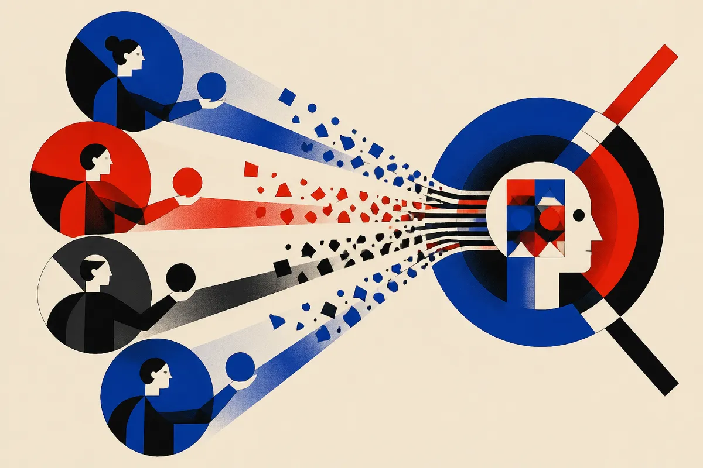

TL;DR: When distilling from multiple teachers, the useful signal may be what each teacher learned during post-training, not the full behavior of the final teacher model.

## What problem does Δ-MOPD solve?

The primary source here is the arXiv cs.AI/cs.LG paper titled "Composing What Each Teacher Learned: Multi-Teacher On-Policy Distillation through Teacher-Relative Shifts." Its core point is simple and useful: multi-teacher distillation often copies too much.

In normal multi-teacher on-policy distillation, a student generates rollouts, then one or more teachers score those rollouts and shape the student’s next update. This can happen in at least two patterns. In common-domain composition, several teachers judge the same prompt domain and their signals are combined into one target. In routed-domain distillation, prompts from different domains go to corresponding specialist teachers.

The paper argues that both setups commonly transfer the teacher’s endpoint policy. That endpoint includes two things mixed together: what the teacher actually learned during post-training, and preferences inherited from the teacher’s own base model.

That second part matters. If the teacher’s base-model behavior pulls harder than the post-training change, the student may inherit a bunch of background preference that was never the reason you picked that teacher.

Δ-MOPD changes the target. Instead of copying the endpoint teacher policy, it transfers the teacher-minus-base logit shift, then re-anchors that shift at the student’s frozen initialization. Put less formally: copy the direction of improvement, not the whole personality.

## Where does the delta target actually help?

The paper’s strongest result is in composition, when multiple teachers are combined at the same state.

With three composed teachers, Δ-MOPD beat endpoint composition by 4.11 Math points and 1.95 points across five benchmarks. With two composed teachers, it matched endpoint accuracy. That is not a giant universal win, but it is a real signal about where this technique matters.

The mechanism claim is also important. The paper reports that removing inherited base pull reduces the teacher-term norm ratio and the target-student KL. In plain English, the target becomes less dominated by irrelevant inherited behavior and less far from the student. That should make training less noisy.

The routed-domain results are more mixed, and that is useful. Under phased routing, Δ-MOPD achieved higher mean performance in both phase orders and reduced the observed order gap from 10.50 to 6.42 points. That suggests the delta framing may help when signals accumulate across training phases.

Under interleaved routing, where each update involves one teacher, endpoint targets and shift targets performed comparably. So this is not “delta always wins.” It looks most compelling when teacher signals are being combined, either at the same moment or across phases.

## Why should builders care about target construction?

Most distillation talk focuses on teacher selection. Pick the best math model. Pick the best coding model. Pick the best reasoning model. Route tasks correctly. That still matters.

But this paper says target construction is its own design axis. Once you pick the teachers, you still need to decide what part of each teacher to transfer.

That distinction gets more important as teams try to build smaller, cheaper, domain-mixed models. A company may want a student that learns from a math specialist, a coding specialist, and a customer-support specialist. If endpoint distillation pulls in each teacher’s base-model quirks, the student can become a compromise model full of hidden baggage. Δ-MOPD is an attempt to isolate the useful post-training edits.

My read: this is the kind of work that matters more in training shops than in product demos. Nobody will market a model by saying “we re-anchored teacher-relative logit shifts.” But if you are trying to compose skills into a smaller model without dragging along every teacher’s inherited bias, this is exactly the detail that can change results.

For a practitioner, the immediate move is not to rebuild your pipeline around Δ-MOPD tomorrow. It is to audit what your distillation target represents. If you are using multiple teachers, especially combined at one state or trained in phases, test endpoint targets against teacher-relative shifts while holding teacher choice fixed. The catch most people miss: a better teacher endpoint is not always a cleaner teaching signal.
