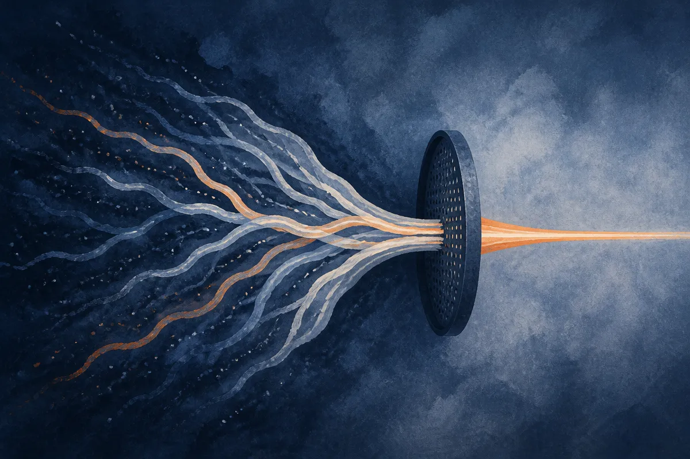

TL;DR: A new method called Exploration-Distillation (ExpDis) runs exploration in a throwaway policy and distills only the good trajectories into a separate student, which lets you crank up novelty hard without wrecking the model, and it beats DAPO at equal compute.

The paper is "Decoupling Exploration from Optimization in RLVR," posted to arXiv across cs.AI, cs.CL, and cs.LG. The core idea is small enough to say in one breath and consequential enough to change how people run reinforcement learning on reasoning models.

Here is the tension it targets. RLVR, reinforcement learning with verifiable rewards, is the thing that turned base models into checkpoints that can actually grind through math and code. The sales pitch for RL over plain supervised fine-tuning was always that the model could discover reasoning strategies nobody wrote down. Sample something novel, check if it's correct, reward it. In theory you get ideas that weren't in the pretraining data.

In practice that promise has mostly not paid off. When teams add strong novelty incentives to the reward, they tend to get worse models, not better ones.

## Why does pushing for novelty usually break the model?

Verifiable rewards are narrow. They check one thing: did the final answer verify. They say nothing about the thousand other behaviors packed into the weights, the formatting, the calibration, the general helpfulness, the ability to not go off the rails.

So when you bolt a big novelty bonus onto that reward, you are pushing the model toward exploration while supervising almost none of its actual knowledge. The authors make this point directly: because verifiable rewards supervise only a narrow slice of the model's behavior, the damage from aggressive exploration is hard to recover from. You chase diversity, the model learns weird habits to collect the novelty bonus, and the narrow reward can't pull it back because it was never watching most of what broke.

That is the real reason "just reward exploration more" has disappointed. It's not that exploration is worthless. It's that you're running exploration and optimization on the same weights, so every risky experiment contaminates the asset you're trying to improve.

## What does ExpDis actually do differently?

It splits the job in two. One or more explorer policies get trained with the novelty bonus in the reward. Let them roam. Let them be weird. Then you filter their trajectories for correctness and quality, keep the good ones, and distill those into a separate student policy. The student trains without any novelty bonus at all.

Then you repeat. Explore, filter, distill, optimize, and go again for several rounds, alternating between the two phases.

The elegance is in what each half is allowed to be bad at. The explorer can degrade however it wants because it's disposable. You never ship it. You only ship the student, and the student only ever sees filtered, correct, high-quality trajectories plus clean optimization. The novelty damage lives and dies in the explorer. The student gets the upside without the risk.

This is a familiar move in a new place. Decoupling the thing that searches from the thing that commits is an old pattern in RL, but doing it as explore-then-distill on top of RLVR checkpoints, specifically to protect a reasoning model from novelty-induced rot, is the contribution here.

## Does it actually beat the baseline?

The paper reports that across seven mathematical reasoning benchmarks and two model families, ExpDis outperforms DAPO at the same wall-clock budget. That last clause matters more than the win itself. Equal wall-clock means they aren't buying the gain with extra compute you don't have. The explorer phase costs something, and they still came out ahead at the same time budget as the DAPO baseline.

The second result is the one I'd watch. They report improved pass@k scaling. Pass@k measures whether at least one of k sampled answers is correct, and it's the honest way to see if a model has real solution diversity or has just collapsed onto one memorized path. A lot of RLVR quietly trades diversity for pass@1: the model gets better at its single best guess and worse at everything else. Better pass@k scaling says ExpDis produces models that generate more diverse correct solutions, which is exactly what the original promise of RL exploration was supposed to deliver.

Two caveats I'd flag honestly. One, this is math reasoning with verifiable answers. The whole method leans on being able to filter trajectories for correctness, and math gives you a clean verifier. Domains without a cheap ground-truth check don't get this for free. Two, the sources here are the abstract across three arXiv categories. I don't have the full tables, the exact benchmarks, or the hyperparameters in front of me, so treat the magnitude of the wins as reported rather than independently confirmed until the full paper and numbers are in hand.

## Why should a builder who isn't training models care?

Because the pattern generalizes past the training loop, and that's where it earns its keep for the rest of us.

The lesson is: keep your risky search separate from your production asset. If you're running an agent and you want it to try unusual tool sequences or novel plans, don't let that experimentation write back into the prompt, memory, or policy you actually ship. Run the exploration in a sandboxed instance, filter the results by whether they actually succeeded, and promote only the verified-good behaviors into your production path. Same shape as ExpDis, just at the application layer instead of the weights.

The catch most people will miss: ExpDis works because the verifier is cheap and trustworthy. The explorer can go feral precisely because the filter is strict and correct. If your filter is noisy, you're distilling garbage into your student with extra steps, and you've just automated your own quality drift. The method doesn't remove the need for a good evaluator. It concentrates all of your evaluation burden onto that filter, which is exactly where it should be.

So the practical experiment: find the one place in your pipeline where you're letting experimentation and production share the same memory or weights, and cut it. Fork off a disposable explorer, make the filter ruthless, promote only what verifies. ExpDis is a formal argument that this separation isn't just tidier, it actually scores higher at the same budget. The hard part was never having good ideas. It was keeping the bad ones from leaking into the thing you ship.
