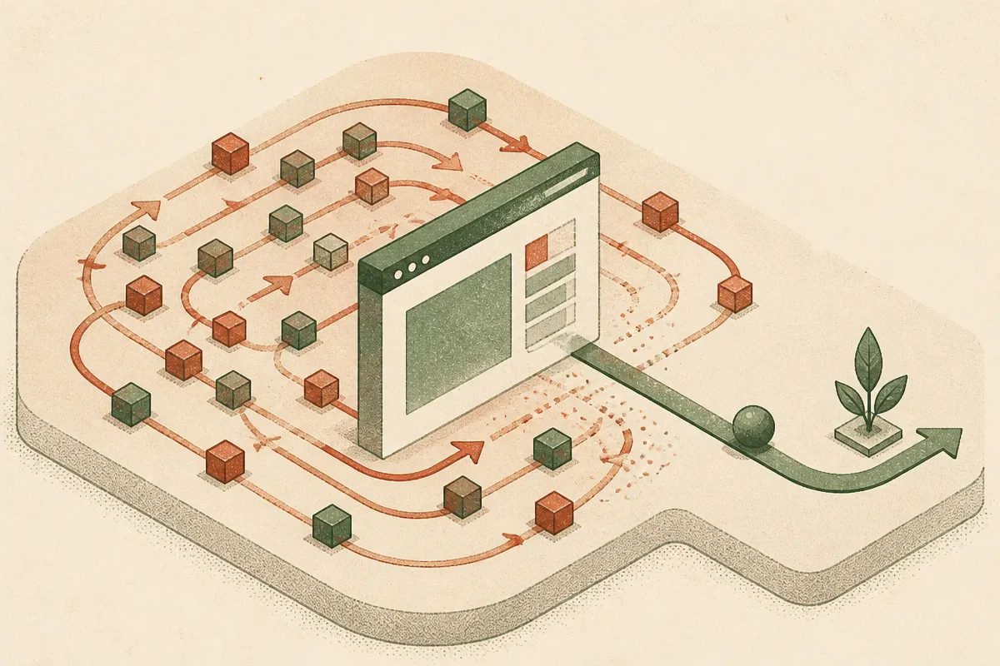

TL;DR: The useful takeaway from Asana’s reported 76x cost cut is not “agents are solved,” it is that browser agents become viable when teams attack the whole loop: model choice, speed, retries, and task design.

## What did OpenAI say Asana actually achieved?

OpenAI’s primary post is titled “Asana cuts model costs 76x in browser tests with GPT-6.1 Sol.” The summary says that, using GPT-6 Astra in Codex, Asana made its browser agent 76x cheaper and 5x faster in tests, with the goal of offering customers more capable models.

That is a big number. It is also a narrow one.

OpenAI is reporting a test result, not a broad production benchmark across every Asana workflow. The post, as provided, does not give the task set, sample size, baseline model, cost accounting method, success rate, or whether the 5x speedup came from the model, fewer steps, better tool calls, reduced retries, browser automation changes, or some combination.

Also, the naming is odd in the material available here: the title says GPT-6.1 Sol, while the summary says GPT-6 Astra in Codex. I would not smooth that over. If the model label matters to your roadmap, wait for the full first-party detail before treating this as a clean model-to-model comparison.

Still, the shape of the result matters. Browser agents are one of the places where AI cost gets ugly fast. They do not just answer once. They observe, decide, click, wait, read, recover, and try again. Every extra loop burns tokens, wall-clock time, and user trust.

## Why are browser agents so sensitive to cost and latency?

Because the unit of work is not a prompt. It is a chain.

A normal chat interaction might be one request and one response. A browser agent might need dozens of model calls for a task that a human sees as “update this project field” or “find the right record and change its status.” If the agent misreads the page, clicks the wrong control, waits too long, or has to re-plan, the bill multiplies.

That is why a 76x cost reduction, if it holds up under real workloads, is more than procurement trivia. It changes what teams can afford to automate. A workflow that costs too much at 10,000 runs per day may be fine after aggressive routing, smaller context windows, cached observations, or a model that can act correctly in fewer turns.

Latency matters just as much. A 5x faster agent is not only nicer for users. It may change the product surface. Slow agents need progress spinners, handoff states, and user patience. Faster agents can sit inside ordinary workflows without feeling like a separate robot you are waiting on.

## What should builders copy from this?

Do not copy the headline number. Copy the measurement habit.

If you are building browser agents, measure cost per completed task, not cost per token. Track time to completion, number of model calls, number of browser actions, retry rate, and failure type. Separate “model got it wrong” from “page state changed,” “selector failed,” “auth interrupted,” and “task was underspecified.”

Then test routing. A powerful model may be worth using for planning, exception handling, or final verification, while cheaper calls handle observation cleanup or routine next-step selection. Sometimes the cheapest agent is not the one using the cheapest model. It is the one that needs fewer attempts.

The catch most readers miss: agent economics are product economics. A demo can survive ten unnecessary loops. A customer-facing workflow cannot. I would start with one narrow browser task, instrument every step, and run the same task set across model and prompt variants before expanding. The win is not “use the newest model.” The win is knowing exactly where the agent burns money, time, and trust.
