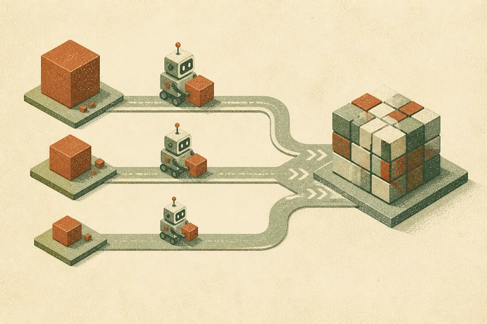

TL;DR: LegalOn’s reported 65% Codex cost reduction is a reminder that coding-agent budgets are managed through task routing and guardrails, not wishful thinking about “AI getting cheaper.”

## What did LegalOn actually change?

The primary source here is OpenAI’s blog post, “LegalOn halves Codex costs while maintaining development speed.” OpenAI reported that LegalOn cut estimated daily Codex costs by 65% while keeping development speed steady.

That is the whole story worth paying attention to.

Not “agents replace engineers.” Not “coding gets free.” Not even “use Codex and your costs drop.” The useful claim is narrower: LegalOn matched Astra, Sol, and Luna to different tasks, then managed budgets more deliberately.

OpenAI’s short writeup does not give enough detail to audit the before-and-after setup. We do not get baseline usage, team size, task mix, billing mechanics, quality metrics, review burden, or failure rates. So I would not treat this as a plug-and-play benchmark.

But the operating pattern is familiar and important. Teams often start with coding agents by giving everyone the most capable setup for every job. That works for adoption because friction is low. It also creates a spend problem fast. Small refactors, test fixes, exploratory prompts, bug hunts, docs edits, and architecture changes do not all need the same model, context size, or runtime budget.

LegalOn’s move, as OpenAI describes it, was not to stop using Codex. It was to stop treating all coding work as equal.

## Why does task matching matter more than blanket cost cutting?

The lazy version of cost control is a hard cap. Fewer runs. Shorter sessions. Smaller context. Less autonomy. That can reduce spend, but it often pushes work back onto engineers in invisible ways.

The better version is routing.

Some work needs the strongest agent because the cost of a bad answer is high. Think cross-file changes, security-sensitive code, migrations, hairy tests, or anything touching production behavior. Other work can tolerate a cheaper or more constrained pass first. Think renames, lint fixes, test generation, documentation, boilerplate, or first drafts.

This is where LegalOn’s reported setup is practical. Matching Astra, Sol, and Luna to tasks suggests a tiered operating model. Use the expensive path when the task justifies it. Use the cheaper path when the downside is low. Keep the human review loop where it matters.

The trap is optimizing for cost per run instead of cost per accepted change. A cheap agent that creates noisy diffs, misses edge cases, or burns reviewer time is not cheap. A more expensive agent that lands a clean patch may be the bargain.

That is the metric I would want from any team making this claim: accepted PRs, review time, rework rate, test pass rate, rollback rate, and cycle time. OpenAI reported maintained development speed, which is useful, but speed alone is not enough. If quality drops or review load rises, the cost just moved desks.

## What should builders copy from this?

Copy the control system, not the headline.

Start by separating coding-agent work into rough classes. Low-risk chores. Medium-risk feature support. High-risk architectural or production changes. Then decide which agent setup is allowed for each class, with escalation paths when the first pass fails.

Track spend daily, but do not manage only by spend. Pair it with engineering signals that already matter: merged changes, review comments, failing tests, reopened bugs, and time from ticket start to accepted code. If the cheaper route saves tokens but adds another review cycle, call that out.

Also, make budget visible to the people using the tools. Engineers do not need a finance lecture every time they run an agent, but they do need feedback. A quiet meter beats a surprise shutdown.

My practical test would be simple: take one team, one repo, and two weeks of normal work. Route small tasks to the cheaper/default agent path, reserve the stronger path for complex work, and require a short note when someone escalates. Compare accepted changes, review time, and daily spend against the previous two weeks. The catch most readers miss: the routing policy is the product. Without it, “AI coding cost optimization” is just a prettier way to say “please use it less.”
