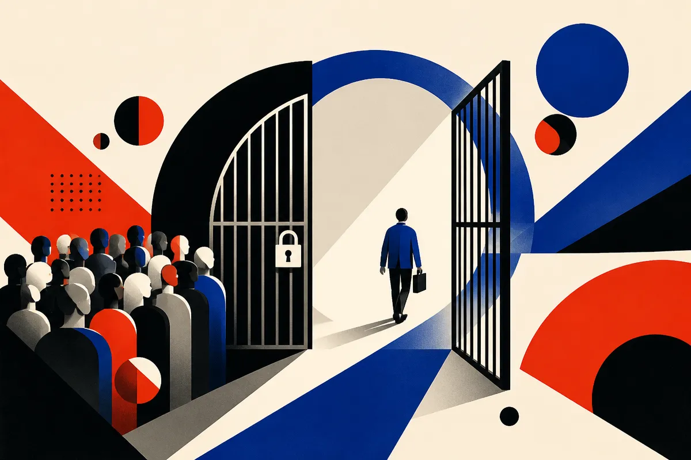
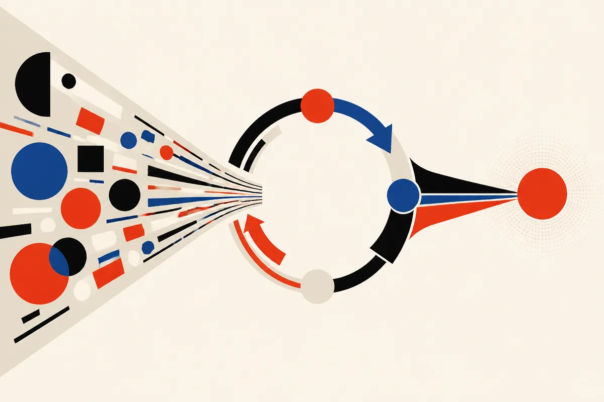

TL;DR: Sophos didn't buy a magic security model; it wrapped an OpenAI planning model in a plan-execute-observe agent loop, fed it the context its human analysts already used, and got investigation time down from 38 minutes to 89 seconds, which is an orchestration win more than a model win.

The headline numbers come from OpenAI's own write-up, "Sophos cuts threat investigation time by 96% with OpenAI Daybreak," and from a companion video featuring John Peterson, Sophos CTO, who runs R&D across the company's products, threat intelligence, and support. Peterson lays out the mechanics in enough detail that you can see what's real here and what's marketing. Both are worth separating.

## What did Sophos actually build?

Strip away the framing and the architecture is familiar to anyone who has shipped an agent in the last year. Peterson describes it plainly: the agent pulls together all the customer context Sophos already has, plus its threat-landscape intelligence and the detections and indicators of compromise tied to a given case. That bundle feeds into a planning model from OpenAI. The model then runs what Peterson calls a "plan, execute, observe loop" that Sophos built around it.

That's the whole trick. The investigation work that used to be "driven mostly by humans" is now "largely automated" by the models plus the agent scaffolding Sophos wrote. Note the two halves. OpenAI supplied the frontier reasoning. Sophos supplied the loop, the context plumbing, and the domain expertise about what a real cyber threat looks like. Peterson is explicit that Sophos is "the cyber security domain experts" and OpenAI brings "the frontier intelligence to allow us to take advantage of all that domain expertise at a scale."

This matters because it's the part most teams get wrong. They treat the model as the product and the context as an afterthought. Sophos did the opposite. The reason their response time collapsed isn't that GPT-whatever is smart. It's that they already knew exactly what context an analyst needed to triage a case, and they wired all of it into the prompt before the model ever started planning. The model is doing the reasoning a trained analyst would do, fast, because it's been handed the same inputs an analyst gets.

## How real is the 89 seconds?

The number that gets attention is 38 minutes down to 89 seconds. Peterson frames it as a trajectory: 18 to 24 months ago, average response time in the managed-detection-and-response (MDR) organization was about 38 minutes. Over the last year, as the agents rolled out, that compressed to 89 seconds. OpenAI's blog pairs this with a 96% cut in investigation time and a claim that 52% of MDR cases are now automated.

Be careful about what these figures do and don't say. "Response time" and "investigation time" are not the same measure, and the sources use both. The 52%-automated figure is the one I'd actually watch, because it tells you how much human work got removed versus merely accelerated. Automating half your cases is a real operational shift. It also means the other half still need a human, which is the honest read Peterson doesn't shy away from.

These are vendor-reported numbers from OpenAI's marketing and a Sophos executive in an OpenAI-produced video. That doesn't make them wrong. It does mean you're seeing a best-case, after-the-fact framing with no independent benchmark, no error-rate disclosure, and no breakdown of which case types got automated. A 96% time cut is plausible for well-scoped triage. It tells you nothing about false-negative rates, which in security is the number that can get a customer breached.

## Why does the Daybreak "guardrail" detail matter?

Here's the most interesting thing Peterson says, and it's easy to miss. He describes Daybreak as a program that let Sophos "design agents that have less restrictive guardrails around them." His reasoning: "we're a cyber security operator, so most of the work we do is focused in areas that will trip guardrails." Daybreak, he says, "allows us to get around that and design agents that are much more effective for our business."

Think about what that means. A model tuned to refuse malware analysis, exploit discussion, or network-intrusion techniques is useless to a defender who does exactly that work all day. The same capability that lets you write an exploit lets you understand and block one. OpenAI's standard guardrails can't tell the difference by intent alone, so a program that grants a vetted security vendor looser restrictions is genuinely necessary for the use case to work at all.

It's also a surface worth scrutinizing. "Less restrictive guardrails" for offensive-security capability is precisely the dual-use question that AI safety people argue about. The defensive justification is real. So is the reality that the same unlocked capability is attractive to the people Sophos is defending against. OpenAI hasn't published, in these sources, how Daybreak vets participants or scopes what the loosened guardrails permit. That's the piece I'd want documented before treating this as a clean win. The sources name the program and its effect, not its controls.

## What should a builder take from this?

The transferable lesson has nothing to do with security. It's the shape of the system.

Sophos's result came from three moves any team can copy. First, they inventoried the exact context a human expert uses to make a decision, then made all of it available to the agent, not a trimmed-down version. Second, they chose a plan-execute-observe loop instead of a single model call, which lets the agent gather evidence, act, check the result, and revise, the way a person actually works a case. Third, they kept humans on the remaining half of the work and reported that split honestly rather than claiming full autonomy.

The catch most readers will miss: the 89 seconds is downstream of years of Sophos knowing what good triage looks like. The agent didn't learn that; it inherited it. If your organization can't articulate the decision an expert makes and the inputs they use, no planning model will rescue you, it'll just be confidently wrong faster. Start by writing down the human workflow in enough detail that you could hand it to a new analyst. That document is the actual product. The model is the cheap part.

So the move to try this quarter: pick one high-volume investigation or triage task, document the exact context your best person pulls to resolve it, wrap a planning model in a plan-execute-observe loop with that context wired in, and measure what fraction you can fully automate versus merely speed up. Report both numbers honestly. That's the Sophos playbook, minus the security-specific guardrail exception, and it's reproducible without a special program.
