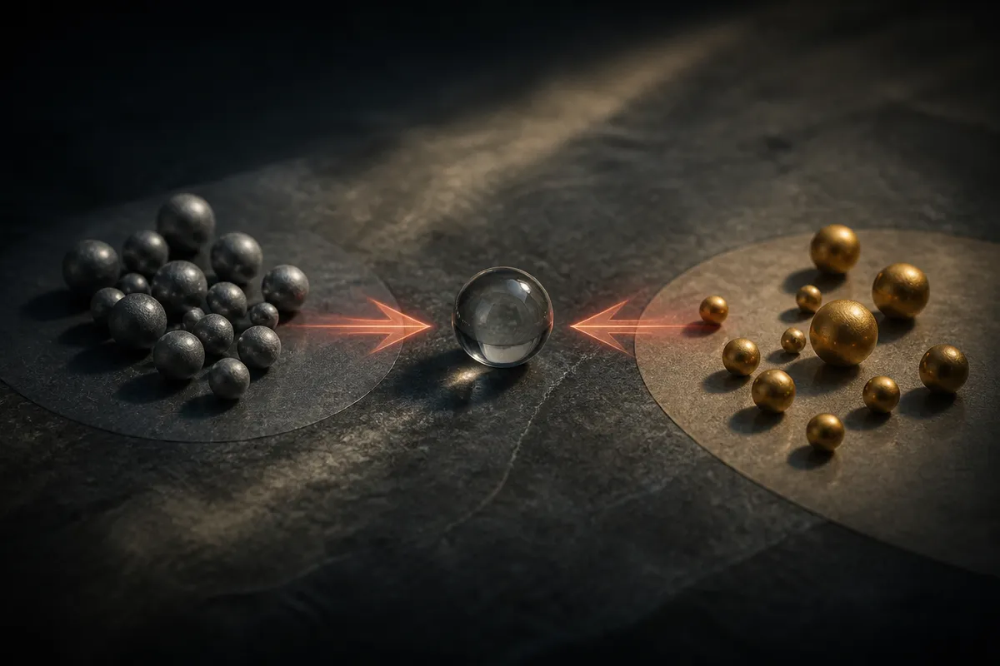

TL;DR: Most learned physics surrogates assume one input maps to one output, which breaks at bifurcation points where a system can go two or more equally valid ways, and Bi-FORK is a generative approach that learns all the branches at once instead of blurring them into a wrong average.

The paper is "Bi-FORK: Generative Modeling of High-Dimensional Bifurcating Systems," posted to arXiv under both cs.AI and cs.LG. I am working from the abstract only here, so treat the specific results as reported by the authors rather than something I have reproduced. But the problem it names is real and it is one most people running ML surrogates do not think about until their model confidently predicts something physically impossible.

## What is a bifurcation and why does it break normal surrogates?

Start with the thing we usually take for granted. When you train a neural network to approximate a physical simulation, you are learning a function: feed in the conditions, get out the result. Press on a beam with this much force, get this much deflection. That one-to-one assumption is baked into how these models are trained and how we evaluate them. Minimize the error between prediction and ground truth, done.

A bifurcation is where that assumption falls apart. At a symmetry-breaking bifurcation, a single input admits multiple equally valid solutions. The classic picture is a straight column under compression. Push hard enough and it buckles, but it can buckle left or right with equal probability. Same input, two outcomes, both physically correct. Nothing in the input tells you which one happens.

Now watch what a standard surrogate does with that. It saw left-buckling examples and right-buckling examples during training, both labeled with the same input. To minimize average error it learns the thing that is closest to both: the straight, un-buckled column. Which never happens in reality. The model produces a smooth, confident, physically impossible answer, and the loss function rewards it for doing so.

This is not a corner case you can ignore. The authors note bifurcations show up across structural buckling, fluid dynamics, and climate dynamics. Anywhere a system has a tipping point or a symmetry that can break, you have potential one-to-many behavior. If you are building surrogates for any of those domains, the regions you most care about, the tipping points, are exactly the regions where the one-to-one model is most wrong.

## How does Bi-FORK actually learn multiple branches?

The core move is to stop treating this as regression and start treating it as generation. Instead of learning a function that maps input to a single output, Bi-FORK (short for Bifurcating FlOw with Repulsion-guided branch recovery, as the name suggests) learns a distribution over solutions and samples from it. That is the right conceptual frame. A one-to-many map is a distribution, not a function, and generative models are built to represent distributions.

Two pieces stand out in how the authors describe it. First, latent flow matching to generate complete trajectories. Rather than predicting a single snapshot or state, Bi-FORK generates the whole trajectory through time, in a compressed latent space, preserving space and time coherence. That matters because a buckled beam is not just a final shape, it is a path from straight to bent, and the path has to be physically continuous. Generating snapshots independently would give you incoherent flicker.

Second, and this is the clever part, repulsion-guided sampling to recover distinct branches in a single amortized pass. The problem with naive sampling from a generative model is that it can collapse onto one mode. Sample a hundred times and get a hundred left-buckled beams, never the right-buckled branch. Repulsion guidance pushes samples away from each other during generation so they spread across the distinct solution branches instead of piling onto the most likely one. And "single amortized pass" is the operator-relevant phrase: you are not retraining or running expensive branch-by-branch optimization for each new input, you get the branches out in one shot.

## Does it scale to problems anyone cares about?

This is where I perked up, because mode-covering generative tricks are easy to demonstrate on toy 2D problems and hard to make work at real resolution. The authors report evaluating Bi-FORK on buckling beams, mechanical metamaterials, and Allen-Cahn phase separation, which they describe as spanning continuous, discrete, and field-valued bifurcations. That spread matters. It is not one cherry-picked system, it is three qualitatively different kinds of branching.

The number that caught my eye: discretizations up to 260,000 points. The claim is that Bi-FORK recovers the multimodal solution structure while scaling several orders of magnitude beyond prior approaches. If that holds up under scrutiny, the "several orders of magnitude" is the whole story. Representing multiple solution branches has been doable at small scale for a while. Doing it at 260k-point field resolution is what moves this from a methods curiosity toward something you could point at an actual engineering mesh.

I want to flag the honest caveats, because the abstract is all I have. "Recovers the multimodal solution structure" is a qualitative claim without the branch-coverage metrics, the sample counts, or the failure modes in front of me. Repulsion-guided sampling has a known tension: push too hard and you invent spurious branches that are not physically real, push too soft and you miss real ones. How Bi-FORK tunes that, and how it knows how many branches to expect, is exactly the detail that separates a clean result from a fragile one. I would read the full paper for the branch-recall numbers before trusting it on a new system.

## What should a builder take from this?

If you train surrogates for physical systems, the practical lesson is upstream of Bi-FORK itself: audit whether your problem has bifurcations at all, and whether your current model is silently averaging them. The tell is a surrogate that performs well on aggregate error but produces smooth, implausible outputs right where the physics gets interesting. That smoothness is not accuracy, it is your loss function papering over a one-to-many region. Check it by sampling the ground truth near suspected tipping points and seeing if multiple distinct outcomes share the same input.

If they do, the fix is a reframe, not a bigger regressor. Treat the output as a distribution and reach for a generative approach: flow matching or diffusion in a latent space for the trajectory, plus an explicit mechanism to spread samples across modes rather than collapse onto the likeliest one. Bi-FORK is one instantiation of that recipe, and the parts are reusable even if you do not use their exact code.

The catch most readers will miss: the hard part is not generating diverse samples, it is validating that the branches you generated are the real ones and that you got all of them. A model that produces two plausible-looking branches when the true system has three is more dangerous than an obviously-wrong averager, because it looks right. So whatever you build, pair it with a physics check, conservation laws, energy, boundary conditions, that can reject spurious branches the generator invents. The generative model proposes. The physics still has to decide.
