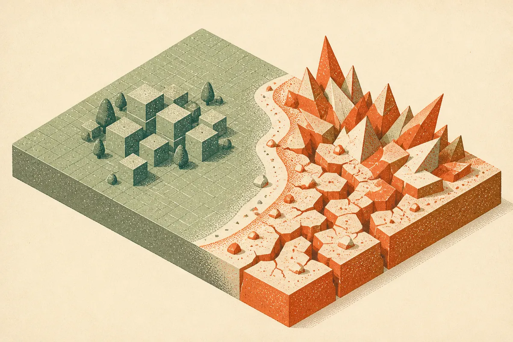

TL;DR: A formula that predicts when chatbots degrade could be useful, but only if it maps to the messy failures operators actually see in production.

## Can a formula predict when a chatbot turns bad?

Decrypt’s report, “Here’s a Way to Predict When AI Chatbots Will Turn Bad,” says physicists at George Washington University have proposed a formula that can estimate when an AI chatbot will flip from good answers to bad ones, with early tests on small models supporting the idea.

That is a neat claim. It is also exactly the kind of claim that needs careful handling.

The basic operator dream is simple: instead of discovering model failure through angry users, bad support replies, broken agent workflows, or screenshots on X, you would get a warning signal earlier. A threshold. A stability measure. Some way to say, “this system is close to the edge.”

That matters because chatbot failure is rarely binary at first. Models do not usually go from perfect to useless in one response. They drift. They get overconfident. They start missing constraints. They follow the wrong instruction hierarchy. They hallucinate in narrower corners. They pass the demo and fail under load, context length, adversarial prompts, weird formatting, or boring real-world ambiguity.

The GW physicists’ framing, at least as Decrypt reports it, sounds like a physics-style phase change: a system behaves one way, then crosses a boundary and behaves differently. That analogy is useful. But analogy is not a deployment plan.

## What would make this useful in production?

For builders, the useful version is not “we can predict badness.” The useful version is more specific: “we can predict this model’s failure rate on this task family before it crosses an unacceptable threshold.”

That means the formula has to connect to evals.

If you run a customer support bot, bad might mean policy violations, refunds offered incorrectly, or escalation failures. If you run a coding agent, bad might mean tests pass for the wrong reason, files get modified outside scope, or the agent hides uncertainty. If you run a medical intake assistant, bad has a much higher bar, and “mostly right” is not a comfort phrase.

So the question is whether this method can attach to task-specific measurements, not just generic chatbot quality. Early tests on small models are interesting, but small-model behavior often fails to transfer cleanly to frontier systems, tool-using agents, retrieval-heavy workflows, and long-context products. Not because small models are irrelevant. Because production AI systems are layered. The model is only one part of the failure surface.

There is also the measurement problem. “Good answers” and “bad answers” sound obvious until you have to label 5,000 outputs. Human raters disagree. Automated judges drift. Benchmarks get saturated. Prompts leak into training data. A clean formula sitting on top of noisy labels can look more precise than it is.

## Where should skepticism sit?

I like this line of work because reliability needs more math and fewer vibes. The AI industry still leans too hard on leaderboard movement, anecdotal demos, and “it felt better in my tests.” Anything that gives teams earlier warning about degradation is worth exploring.

But I would not treat this as a safety system yet. Decrypt’s reporting does not provide, in the material here, the paper title, arXiv ID, formula details, model list, benchmark setup, or failure definition. That matters. Without those, the honest read is: promising pointer, not a method you can copy into an eval stack tomorrow.

The bigger idea is still strong. We should be looking for leading indicators, not only post-mortems. Model reliability work should ask: what changes before failure becomes visible? Confidence shape? Entropy? Answer variance across paraphrases? Sensitivity to context ordering? Tool-call instability? Refusal inconsistency? Those are the kinds of signals operators can test.

My practitioner’s take: if I were building with this today, I would not wait for the formula to mature. I would define three concrete failure modes, build a small eval set for each, run the model across prompt variants and context stress tests, and track when answers start to wobble before they break. The catch most teams miss is that “turning bad” is not one event. It is usually a local failure under a specific workload, and your warning system has to know what bad means for your product.
