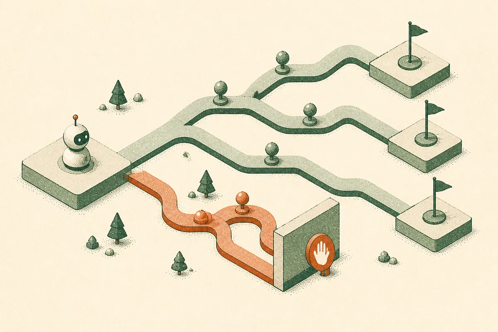

TL;DR: OnTrack is a practical agent monitor that compares live tool-use trajectories against successful runs, so builders can interrupt likely failures before the agent burns the full budget or takes an irreversible action.

## What is OnTrack actually monitoring?

The primary source is the arXiv cs.CL paper **“OnTrack: Real-Time Monitoring and Intervention in LLM Agent Trajectories via Streaming Structure-Aware Optimal Transport.”** The important move is that OnTrack does not try to decide whether every agent thought is “right.” It watches the shape of the run.

That matters because agents fail in boring, expensive ways. They loop. They stall. They repeat the same tool call. They wander away from a known successful plan. Post-hoc evals can tell you that after the trace is done. A separate safeguard agent can watch along the way, but that adds model calls, latency, and another agent that can be wrong.

OnTrack takes a different path. It compares an agent’s live steps and dependencies against recorded successful trajectories. The paper frames this as streaming structure-aware optimal transport. Plain English: it measures whether the current run still looks structurally close to runs that worked, as the run is happening.

The reported overhead is the number that caught my eye: about a millisecond per step. If that holds outside the benchmark setup, this is the right kind of boring infrastructure. Not a giant judge model. Not a dashboard you inspect tomorrow. A cheap tripwire in the loop.

## How much can it know before the run starts?

OnTrack is useful because it admits a messy deployment truth: you do not always have the same level of access.

The paper studies three regimes. In the best case, you have historical successful runs and tool schemas. That lets OnTrack detect richer plan violations, because it knows what successful structure tends to look like. In the middle case, it only has tool schemas. In the hardest case, it has no prior knowledge beyond the step logs being generated during the current run. As access drops, the monitor gets less ambitious. It moves from comparing against known successful trajectories toward catching generic failure patterns like loops, stalls, and repeated tool calls.

That is the right shape for a production tool. Most eval ideas assume a clean lab setting. Real systems are uneven. Some workflows have months of clean traces. Some are brand new. Some tools are well documented. Some are a pile of wrappers around internal APIs. A monitor that degrades gracefully is more credible than one that only works when your data is perfect.

## What do the SWE-bench results tell us?

OnTrack was evaluated using SWE-bench trajectories. Based on only the first 8 steps, OnTrack ranked failing trajectories below succeeding ones better than content similarity approaches, with a reported +0.057 AUROC gain.

That is not a moonshot number. Good. I trust modest numbers more when the problem is this hard. The more concrete operational result is the abort policy: OnTrack saved about 18% of compute that would have been spent on failing runs, and 83% of interrupted runs were actually heading toward failure. The paper spells that out as 5 out of 6 aborts being correct.

There is a catch. An abort policy is not free. The one wrong abort might have been a recoverable run. In coding agents, that may be acceptable if the system can restart with a different prompt, model, or plan. In higher-stakes settings, like IT incident triage or any workflow with irreversible actions, the policy should probably be “pause and ask” before it becomes “block automatically.”

My read: OnTrack is less about proving agents are safe and more about making agent runs observable enough to manage. That is a lower claim, and a more useful one.

If I were building with agents today, I would start logging trajectories in a structured way now: tool calls, dependencies, timing, retries, and final outcome. Then I would add a simple monitor for loops and repeated calls before chasing the full optimal-transport setup. The catch most teams miss is that real-time intervention needs good historical traces. If you are not storing successful and failed runs cleanly, you are not ready for the interesting monitor yet.
