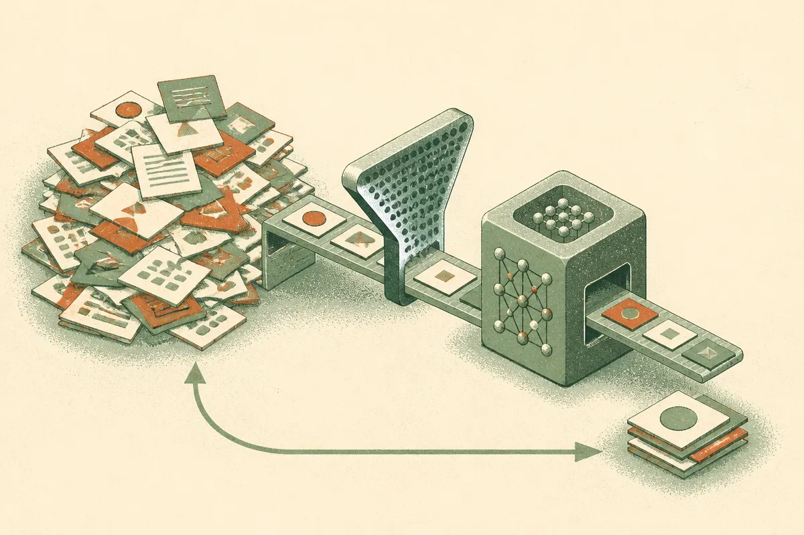

TL;DR: Skill banks can improve models, but SGUID shows the real gain comes from distilling only the skills that actually teach the current model.

## What is SGUID selecting?

The primary source here is the arXiv cs.CL paper, “Which Skill to Distill? SGUID: Selecting a Compact Skill Bank for Model-Skill Co-Evolution.”

The setup is familiar if you have built with agents, prompt libraries, or tool instructions. You collect “skills,” meaning reusable procedural guidance. At inference time, a system retrieves relevant skills and gives them to the model. Prior work has also used those retrieved skills as teachers for distillation, so the model internalizes the behavior rather than needing the external patch every time.

The paper’s point is that semantic relevance is a weak filter. A skill can look related to the task and still fail to provide a useful learning signal. SGUID keeps a skill only when it consistently produces effective learning signals during training.

That sounds small, but it changes the mental model. The question is not, “Does this instruction match the query?” The better question is, “Does this instruction help this model learn something it does not already do well?”

That distinction matters because skill banks tend to accrete junk. Teams add examples, tool recipes, policy snippets, prompt tricks, and workflow notes. Bigger feels safer. SGUID argues the opposite can be true during distillation. More skills can mean more noise.

## Why can fewer skills beat a full bank?

The headline number is blunt: in on-policy distillation, where skill-conditioned policies act as teachers, fewer than 25% of retrieved skills provided useful distillation signals.

SGUID then selects a compact subset. Across four models from the Olmo and Qwen families, distilling 6 selected skills matched or exceeded full-bank distillation in mean avg@12 on three of the four models. After a second round that distilled 3 newly selected skills, SGUID matched or exceeded full-bank distillation on all four. The full banks were up to 11x larger.

That is not just a storage win. It is a training-quality win.

The more interesting part is the loop. After one distillation round, the updated model generates new rollouts. A new candidate bank is curated from those rollouts. SGUID then selects which new skills to internalize next. The paper calls this model-skill co-evolution, and that phrase is useful. The right skill for an earlier model may be stale after the model improves.

The reported Qwen3-8B result is a clean example: in the second round, SGUID selected 3 new skills and improved performance from 64.3% to 66.3%.

The stability result is the warning label. On Qwen3-4B, naively updating the model with unfiltered skills degraded performance, including a 0.3 percentage point drop on HMMT25. SGUID improved HMMT25 by 0.5 points after the first round and 1.1 points after the second.

So the practical claim is not “skills work.” It is narrower and more useful: selection is the control mechanism that keeps iterative distillation from drifting.

## What should builders copy from this?

I would not overread the paper as proof that every system needs exactly 6 skills, or that every agent stack should distill its prompt library. The benchmarks and model families matter. The paper reports results on Olmo and Qwen-family models, with metrics including mean avg@12 and HMMT25. That is evidence, not a universal law.

But the operating lesson travels well.

If you maintain a prompt library, agent playbook, RAG instruction set, or workflow recipe bank, stop treating retrieval relevance as the same thing as usefulness. Log whether a skill changes the answer, reduces errors, improves tool use, or helps the model solve cases it previously missed. Then prune against that signal.

Practically, I’d try SGUID’s pattern before copying its exact machinery: collect candidate skills from real rollouts, score them by whether they produce measurable improvement for the current model, distill or preserve only the winners, then repeat after the model changes. The catch most teams miss is that the skill bank is not a permanent knowledge base. It is a moving training interface between the model you have now and the model you are trying to make next.
