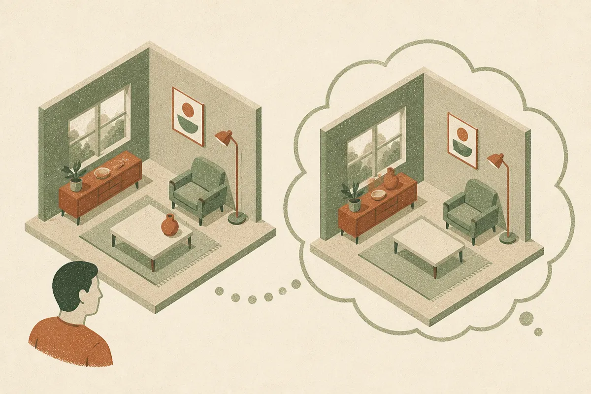
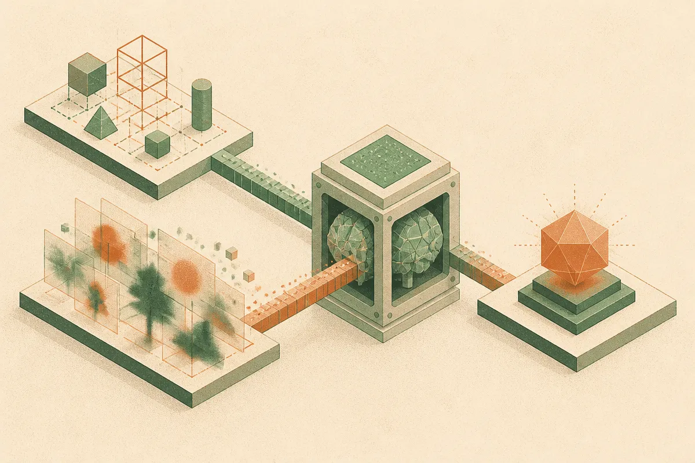

TL;DR: Vision-language models can read spatial relations off an image, but ask them to predict how a scene changes after an action and the best one scores 58.0% against 87.2% for humans, which means your multimodal agent probably cannot reason about what it cannot already see.

The paper is SpaceCast-Bench: Evaluating Predictive Spatial Reasoning in Vision-Language Models, posted to arXiv cs.CL. It makes a distinction that sounds pedantic until you sit with it: there is a difference between perceiving space and predicting it. Most spatial benchmarks test the first. This one tests the second, and the results are humbling.

## What is predictive spatial reasoning, and why does the distinction matter?

Perception is reading off what is already there. The mug is left of the laptop. The chair faces the window. A capable VLM handles this well, because the answer is visible in the pixels.

Prediction is harder. You observe a scene, imagine an intervention (move the chair, rotate the object, walk to the other side of the room), and reason about an outcome you never actually saw. The authors call this an observe-transform-infer framework, and they split tasks into three levels: static perception, local prediction, and global prediction. Each level asks for more. First understand the scene, then update its spatial state after a change, then do relational inference over an outcome nobody photographed.

This is exactly the capability a robot or an embodied agent needs. A warehouse picker has to know that moving box A clears a path to box B before it moves anything. A home robot has to anticipate that opening a cabinet door will block the drawer below. None of that is in the input frame. It has to be constructed.

SpaceCast-Bench is built around 3,862 questions drawn from 182 real-world scenes, spanning 16 task types across those three levels. The framing is the contribution here. Plenty of benchmarks throw hard questions at models. Fewer are diagnostic, meaning they isolate *where* a model breaks rather than just reporting a single blended score.

## How badly do current models actually do?

The headline number: the strongest of 21 evaluated models reaches 58.0%. Humans hit 87.2%. That is a roughly 29-point gap on a task humans find natural.

The more damning detail is about the specialized models. The paper reports that spatially specialized models (ones built or tuned specifically for spatial tasks) remain near random chance on predictive reasoning. Read that again. The models marketed as spatial experts do not transfer from perception to prediction. They learned to read relations, not to simulate them. That is a strong signal that current spatial tuning teaches pattern matching on visible layouts, not an internal model of how scenes evolve.

I take this seriously because it maps to something I keep seeing in applied work. A model can describe a screenshot in exact detail and then fail completely when you ask what happens after a click. Description is not simulation. SpaceCast-Bench gives that intuition a number.

## What helps models close the gap?

The controlled analyses are the useful part for builders, because they tell you what kind of evidence actually moves the needle.

Two findings stand out. First, bridge views are critical. When observations are distributed across multiple viewpoints, a connecting intermediate view helps the model stitch them into one coherent scene. Without that bridge, the model treats each view as an island and cannot integrate them. If you are feeding a VLM multiple camera angles and expecting it to fuse them, this says you probably need overlapping or connecting frames, not just more frames.

Second, and this one surprised me: explicit 3D evidence benefits models more reliably than generated outcome images or videos. The intuitive move for predicting an outcome would be to generate a picture of the predicted state and reason over that. The paper found that does not work as reliably as handing the model structured 3D information. Generated outcome images and videos are noisy, and the model inherits the noise. Structured 3D geometry is cleaner signal.

That has a direct implication. If you are tempted to bolt a video generator onto your agent pipeline so it can "imagine" outcomes, this result suggests the structured route beats the generative one for reasoning accuracy, at least today.

## Does fine-tuning fix it, or just overfit?

Here is the hopeful part. The authors programmatically generated training data from their framework and fine-tuned Qwen3-VL-4B on it. The score jumped from 34.0% to 65.7%. A 4B model, after targeted fine-tuning, lands ahead of the best off-the-shelf model's 58.0%.

The number that matters more is the generalization claim. The paper reports macro-average gains across six out-of-domain benchmarks, not just on SpaceCast-Bench itself. That is the difference between teaching a model the test and teaching it the skill. If the gains only showed up in-domain, I would call it overfitting and move on. Out-of-domain transfer across six benchmarks is the signal that something real got learned.

Treat this with appropriate caution. It is one benchmark, one paper, from one team, and I have not seen independent replication. Programmatically generated training data can encode the generator's own blind spots, and "out-of-domain" benchmarks can still share structural assumptions with the training set. But the result is specific and the direction is clear: predictive spatial reasoning looks learnable with the right synthetic data, and it does not require a frontier-scale model to get there.

A practitioner's take: if you are building anything that acts in physical or spatial space (robotics, AR, drone navigation, even UI agents that have to predict post-action state), stop trusting a model's scene description as proof it understands the scene. Build a small eval that separates perception from prediction, the way SpaceCast-Bench does, and run it on whatever model you ship. You will likely find the same gap. The practical path forward is not a bigger model, it is targeted fine-tuning on prediction-style data plus feeding structured 3D evidence instead of generated images where you can get it. The catch most readers miss: the specialized spatial models scoring near chance here are a warning that a label like "spatial" on a model card tells you nothing about whether it can predict. Test the capability you actually need, not the one in the marketing.
